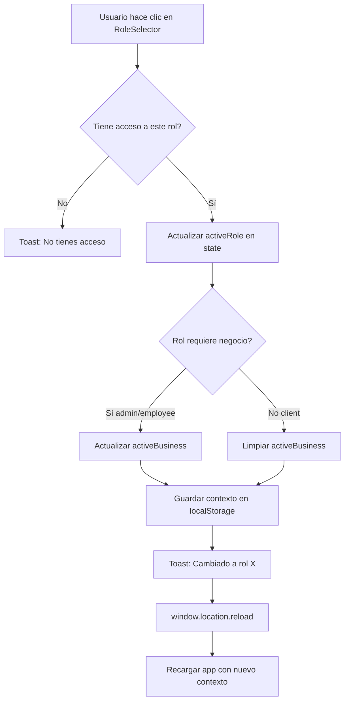

# Sistema de Roles Dinámicos - Documentación

## 📋 Resumen del Cambio

Se ha refactorizado el sistema de roles de AppointSync para que funcione de manera **dinámica y sin almacenamiento en base de datos**. Un usuario puede tener múltiples roles simultáneamente según sus relaciones con diferentes negocios.

---

## 🎯 Concepto Clave

**Los roles NO se guardan en la base de datos**. En su lugar, se calculan dinámicamente basándose en las relaciones del usuario:

```
Todos los usuarios tienen acceso a los 3 roles:
├─ ADMIN (si es owner_id en businesses, tiene acceso completo; si no, verá onboarding)
├─ EMPLOYEE (siempre disponible; si existe en business_employees, tiene acceso; si no, verá onboarding)
└─ CLIENT (siempre disponible, para reservar citas en cualquier negocio)
```

**⭐ IMPORTANTE**: Todos los usuarios pueden iterar entre los 3 roles. Los onboardings guían la configuración cuando no tienen las relaciones necesarias en la BD.

---

## 🔄 Cómo Funciona

### 1. Cálculo Dinámico de Roles

El hook `useUserRoles` consulta:

```typescript
// 1. Negocios donde el usuario es dueño
SELECT id, name FROM businesses WHERE owner_id = user.id
→ Por cada negocio: rol 'admin'

// 2. Negocios donde el usuario es empleado  
SELECT business_id, businesses(id, name) 
FROM business_employees 
WHERE employee_id = user.id
→ Por cada negocio: rol 'employee' con business asignado

// 3. Rol empleado (siempre disponible)
→ Si no tiene relación en business_employees, se agrega rol 'employee' sin business_id

// 4. Rol cliente (siempre disponible)
→ rol 'client' (sin business_id)
```

**Resultado**: Todos los usuarios tienen al menos 3 roles ['admin', 'employee', 'client']. Los roles con `business_id` tienen acceso completo; los que no, ven onboarding.

### 2. Almacenamiento Local

Solo se guarda en `localStorage` el **contexto activo actual**:

```typescript
{
  role: 'admin',           // Rol actualmente seleccionado
  businessId: 'uuid-123',  // Negocio activo (si aplica)
  businessName: 'Mi Negocio' // Nombre del negocio
}
```

### 3. Cambio de Rol

Cuando el usuario cambia de rol:

1. ✅ Se valida que tenga acceso a ese rol
2. ✅ Se actualiza el estado local (React)
3. ✅ Se guarda en localStorage
4. ✅ Se recarga la página para refrescar datos
5. ❌ **NO** se actualiza la base de datos

---

## 📊 Estructura de Datos

### UserRoleAssignment (Generado Dinámicamente)

```typescript
interface UserRoleAssignment {
  id: string                // Generado: `${userId}-${role}-${businessId}`
  user_id: string           // ID del usuario
  role: UserRole            // 'admin' | 'employee' | 'client'
  business_id: string | null // ID del negocio (null para client)
  business_name?: string    // Nombre del negocio
  is_active: boolean        // Siempre true (calculado dinámicamente)
  created_at: string        // Fecha de creación del usuario
}
```

### Ejemplo Real

Usuario Juan (uuid-juan) que:
- Es dueño de "Barbería Premium"
- Es empleado de "Spa Relax"
- Puede reservar citas como cliente

```typescript
roles: [
  {
    id: 'uuid-juan-admin-uuid-barber',
    user_id: 'uuid-juan',
    role: 'admin',
    business_id: 'uuid-barber',
    business_name: 'Barbería Premium',
    is_active: true
  },
  {
    id: 'uuid-juan-employee-uuid-spa',
    user_id: 'uuid-juan',
    role: 'employee',
    business_id: 'uuid-spa',
    business_name: 'Spa Relax',
    is_active: true
  },
  {
    id: 'uuid-juan-client',
    user_id: 'uuid-juan',
    role: 'client',
    business_id: null,
    is_active: true
  }
]
```

---

## 🔧 Implementación Técnica

### Hook: useUserRoles

```typescript
const { 
  roles,           // Array de todos los roles disponibles
  activeRole,      // Rol actualmente seleccionado
  activeBusiness,  // Negocio activo (si aplica)
  isLoading,       // Estado de carga
  switchRole,      // Función para cambiar rol
  hasRole,         // Verificar si tiene un rol
  getRolesByType,  // Obtener roles por tipo
  refetchRoles     // Recargar roles
} = useUserRoles(user)
```

### Uso en Componentes

```typescript
// MainApp.tsx
const { roles, activeRole, activeBusiness, switchRole } = useUserRoles(user)

const handleRoleChange = async (role: UserRole, businessId?: string) => {
  await switchRole(role, businessId)
}

// Mostrar selector solo si tiene múltiples roles
{roles.length > 1 && (
  <RoleSelector
    roles={roles}
    activeRole={activeRole}
    activeBusiness={activeBusiness}
    onRoleChange={handleRoleChange}
  />
)}
```

---

## 🎨 UI: RoleSelector Component

El componente `RoleSelector` muestra:

1. **Botón Principal**: Rol activo actual con icono y nombre del negocio
2. **Dropdown**: Lista de todos los roles disponibles agrupados por tipo
3. **Indicador Visual**: Marca el rol actualmente activo

### Agrupación Visual

```
┌─────────────────────────────┐
│ [🏢] Administrador          │  ← Rol activo
│      Barbería Premium       │
│                        [▼]  │
└─────────────────────────────┘

Dropdown abierto:
┌─────────────────────────────┐
│ Como Administrador          │
│ ├─ [🏢] Admin               │
│ │   Barbería Premium      ● │  ← Activo
│                             │
│ Como Empleado               │
│ ├─ [👥] Empleado            │
│ │   Spa Relax               │
│                             │
│ Como Cliente                │
│ └─ [🛒] Cliente             │
└─────────────────────────────┘
```

---

## 🔒 Seguridad y RLS

### Políticas de Supabase

Las políticas RLS deben validar roles dinámicamente:

```sql
-- Ejemplo: Ver negocios propios (admin)
CREATE POLICY "Users can view businesses they own"
ON businesses FOR SELECT
USING (owner_id = auth.uid());

-- Ejemplo: Ver citas como empleado
CREATE POLICY "Employees can view appointments for their businesses"
ON appointments FOR SELECT
USING (
  business_id IN (
    SELECT business_id 
    FROM business_employees 
    WHERE employee_id = auth.uid()
  )
);

-- Ejemplo: Ver citas como cliente
CREATE POLICY "Clients can view their own appointments"
ON appointments FOR SELECT
USING (client_id = auth.uid());
```

### Validación en Frontend

```typescript
// Validar antes de operaciones sensibles
const handleDeleteAppointment = async (id: string) => {
  if (activeRole !== 'admin') {
    toast.error('Solo administradores pueden eliminar citas')
    return
  }
  
  // Proceder con eliminación
  await deleteAppointment(id)
}
```

---

## 📝 Ventajas del Sistema

### ✅ Pros

1. **Sin Redundancia**: No se duplica información en la BD
2. **Siempre Actualizado**: Los roles se calculan en tiempo real
3. **Flexible**: Un usuario puede tener múltiples roles simultáneamente
4. **Escalable**: Agregar nuevos roles es trivial
5. **Auditable**: Las relaciones (owner, employee) ya están en otras tablas

### ⚠️ Consideraciones

1. **Performance**: Se hacen 2-3 queries al cargar (cacheable)
2. **Recarga de Página**: Necesaria al cambiar rol para refrescar datos
3. **LocalStorage**: Puede desincronizarse si se limpia el navegador

---

## 🔄 Flujo Completo de Cambio de Rol



---

## 🧪 Testing

### Casos de Prueba

```typescript
describe('useUserRoles', () => {
  it('should calculate admin role for business owners', async () => {
    // Mock: user owns business A
    const { roles } = renderHook(() => useUserRoles(mockUser))
    
    expect(roles).toContainEqual(
      expect.objectContaining({
        role: 'admin',
        business_id: 'business-a-id'
      })
    )
  })
  
  it('should calculate employee role from business_employees', async () => {
    // Mock: user is employee in business B
    const { roles } = renderHook(() => useUserRoles(mockUser))
    
    expect(roles).toContainEqual(
      expect.objectContaining({
        role: 'employee',
        business_id: 'business-b-id'
      })
    )
  })
  
  it('should always include client role', async () => {
    const { roles } = renderHook(() => useUserRoles(mockUser))
    
    expect(roles).toContainEqual(
      expect.objectContaining({
        role: 'client',
        business_id: null
      })
    )
  })
  
  it('should restore previous role context from localStorage', () => {
    localStorage.setItem('user-active-role', JSON.stringify({
      role: 'admin',
      businessId: 'uuid-123',
      businessName: 'My Business'
    }))
    
    const { activeRole, activeBusiness } = renderHook(() => useUserRoles(mockUser))
    
    expect(activeRole).toBe('admin')
    expect(activeBusiness?.id).toBe('uuid-123')
  })
})
```

---

## 🚀 Migración desde Sistema Anterior

### Cambios Necesarios

1. **Eliminar columna `role` de `profiles`** (opcional, puede mantenerse para legacy)
2. **Eliminar tabla `user_roles`** si existía
3. **Actualizar políticas RLS** para validar relaciones dinámicas
4. **Limpiar localStorage** de usuarios existentes

### Script de Migración (SQL)

```sql
-- Opcional: Remover columna role de profiles
-- ALTER TABLE profiles DROP COLUMN IF EXISTS role;

-- Limpiar tabla user_roles si existe
-- DROP TABLE IF EXISTS user_roles CASCADE;

-- Actualizar políticas RLS (ver sección de Seguridad arriba)
```

### Script de Limpieza (Frontend)

```typescript
// Limpiar localStorage antiguo
localStorage.removeItem('user-active-business')
// Mantener 'user-active-role' (ahora guarda StoredRoleContext)
```

---

## 📚 Referencias

- **Código Principal**: `src/hooks/useUserRoles.ts`
- **Componente UI**: `src/components/ui/RoleSelector.tsx`
- **Integración**: `src/components/MainApp.tsx`
- **Tipos**: `src/types/types.ts` (UserRole, UserRoleAssignment)

---

## ✅ Checklist de Implementación

- [x] Refactorizar `useUserRoles` para cálculo dinámico
- [x] Eliminar dependencia de tabla `user_roles`
- [x] Eliminar dependencia de RPC `switch_active_role`
- [x] Usar localStorage solo para contexto activo
- [x] Validar acceso antes de cambiar rol
- [x] Agregar toasts informativos
- [ ] Actualizar políticas RLS en Supabase
- [ ] Eliminar columna `role` de profiles (opcional)
- [ ] Probar con usuarios reales
- [ ] Documentar en guía de usuario

---

## 🎉 Resultado Final

El sistema ahora es:

- ✅ **Dinámico**: Los roles se calculan según relaciones reales
- ✅ **Sin Estado en BD**: No hay campo `role` que mantener sincronizado
- ✅ **Multi-Rol**: Un usuario puede tener admin, employee y client a la vez
- ✅ **Flexible**: Cambiar entre roles sin tocar la BD
- ✅ **Persistente**: El contexto se guarda en localStorage
- ✅ **Seguro**: Validación en frontend y RLS en backend

**Ejemplo de uso real**:
```
Juan puede:
- Gestionar su negocio "Barbería Premium" como ADMIN
- Trabajar en "Spa Relax" como EMPLOYEE
- Reservar masajes en "Spa Paradise" como CLIENT
```

Todo sin guardar explícitamente estos roles en ninguna tabla. 🚀
