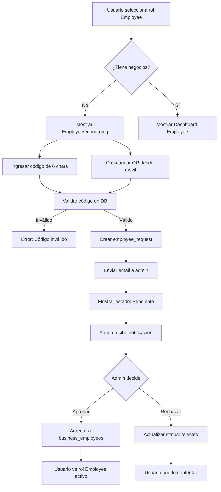
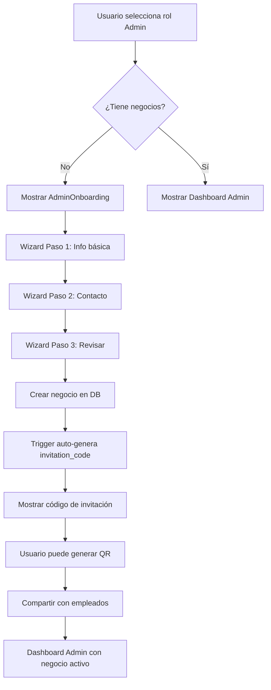

# Sistema de Roles Dinámicos y Onboarding - Implementación Completa

**Fecha:** 11 de octubre de 2025  
**Estado:** ✅ COMPLETADO

## 📋 Resumen Ejecutivo

Se ha implementado completamente el sistema de roles dinámicos con onboarding para empleados y administradores, incluyendo:

- ✅ Sistema de códigos de invitación únicos (6 caracteres)
- ✅ Generación y escaneo de códigos QR
- ✅ Solicitudes de empleado con aprobación/rechazo
- ✅ Pantallas de onboarding para roles sin negocios
- ✅ Reglas automáticas de inactividad de negocios
- ✅ Realtime updates con Supabase

---

## 🗄️ BASE DE DATOS

### Migración Aplicada ✅

Archivo: `supabase/migrations/20251011000001_employee_requests_and_business_codes.sql`

**Nuevos campos en `businesses`:**
- `invitation_code` (VARCHAR(6), UNIQUE) - Código de invitación autogenerado
- `last_activity_at` (TIMESTAMPTZ) - Última actividad del negocio
- `first_client_at` (TIMESTAMPTZ) - Fecha del primer cliente
- `is_active` (BOOLEAN) - Estado activo/inactivo

**Nueva tabla `employee_requests`:**
```sql
CREATE TABLE employee_requests (
  id UUID PRIMARY KEY,
  business_id UUID REFERENCES businesses(id),
  user_id UUID REFERENCES profiles(id),
  invitation_code VARCHAR(6),
  status VARCHAR(20) CHECK (status IN ('pending', 'approved', 'rejected')),
  created_at TIMESTAMPTZ DEFAULT NOW(),
  responded_at TIMESTAMPTZ,
  responded_by UUID REFERENCES profiles(id),
  message TEXT,
  UNIQUE(business_id, user_id, status)
);
```

**Funciones PostgreSQL creadas:**
- `generate_invitation_code()` - Genera códigos únicos de 6 caracteres
- `auto_generate_invitation_code()` - Trigger para autogenerar en INSERT
- `update_business_activity()` - Actualiza last_activity_at
- `track_first_client()` - Registra first_client_at
- `approve_employee_request(request_id, admin_id)` - Aprueba y agrega a business_employees
- `reject_employee_request(request_id, admin_id)` - Rechaza solicitud

**Triggers configurados:**
- Auto-generación de códigos al crear negocios
- Actualización de actividad en cada appointment
- Tracking de primer cliente

**RLS Policies:**
- Usuarios pueden crear sus propias solicitudes
- Usuarios pueden ver sus propias solicitudes
- Admins pueden ver solicitudes de sus negocios
- Admins pueden aprobar/rechazar solicitudes

---

## 🎨 COMPONENTES UI

### 1. EmployeeOnboarding ✅
**Ubicación:** `src/components/employee/EmployeeOnboarding.tsx`

**Funcionalidad:**
- Pantalla fullscreen con gradiente
- Input de código de 6 caracteres (auto-uppercase)
- Campo opcional para mensaje al admin
- Botón "Escanear QR" (info para desktop, cámara en móvil)
- Lista de solicitudes enviadas con estados (pending/approved/rejected)
- Instrucciones del flujo completo

**Props:**
```typescript
interface EmployeeOnboardingProps {
  user: User
  onRequestCreated?: () => void
}
```

**Uso:**
```tsx
<EmployeeOnboarding 
  user={user} 
  onRequestCreated={() => window.location.reload()} 
/>
```

---

### 2. AdminOnboarding ✅
**Ubicación:** `src/components/admin/AdminOnboarding.tsx`

**Funcionalidad:**
- Wizard de 3 pasos con barra de progreso
- **Paso 1:** Nombre, categoría, descripción
- **Paso 2:** Teléfono, email, dirección completa
- **Paso 3:** Revisión y creación
- Alert con reglas de inactividad (30 días / 1 año)
- Genera `invitation_code` automáticamente
- Configuración predeterminada de horarios y settings

**Props:**
```typescript
interface AdminOnboardingProps {
  user: User
  onBusinessCreated?: () => void
}
```

**Categorías disponibles:**
- Salón de belleza, Barbería, Spa
- Clínica médica, Clínica dental
- Gimnasio, Estudio de yoga, Centro de masajes
- Peluquería, Centro de estética
- Consultorio psicológico, Veterinaria
- Taller mecánico, Centro de reparación
- Otro

---

### 3. BusinessInvitationCard ✅
**Ubicación:** `src/components/admin/BusinessInvitationCard.tsx`

**Funcionalidad:**
- Muestra código de invitación en formato grande (font-mono)
- Botones: Copiar código, Compartir
- Generador de código QR con `qrcode` library
- Descarga de QR como PNG
- Instrucciones del flujo de invitación

**Props:**
```typescript
interface BusinessInvitationCardProps {
  business: Business
  className?: string
}
```

**QR Data Format:**
```json
{
  "type": "business_invitation",
  "business_id": "uuid",
  "business_name": "Nombre del negocio",
  "invitation_code": "ABC123",
  "generated_at": "ISO timestamp"
}
```

---

### 4. EmployeeRequestsList ✅
**Ubicación:** `src/components/admin/EmployeeRequestsList.tsx`

**Funcionalidad:**
- Tabs: Pendientes / Aprobadas / Rechazadas
- Badge con contador de pendientes
- Cards por solicitud con:
  - Avatar del usuario
  - Nombre, email, teléfono
  - Mensaje opcional
  - Fecha relativa (hace X tiempo)
  - Botones Aprobar/Rechazar (solo pending)
- Realtime updates vía Supabase
- Estados visuales con badges de colores

**Props:**
```typescript
interface EmployeeRequestsListProps {
  businessId: string
  adminId: string
  className?: string
}
```

---

## 🔧 HOOKS

### useEmployeeRequests ✅
**Ubicación:** `src/hooks/useEmployeeRequests.ts`

**Funciones:**
```typescript
const {
  requests,           // EmployeeRequest[]
  isLoading,          // boolean
  error,              // string | null
  fetchRequests,      // () => Promise<void>
  createRequest,      // (code, message?) => Promise<boolean>
  approveRequest,     // (requestId, adminId) => Promise<boolean>
  rejectRequest,      // (requestId, adminId) => Promise<boolean>
  pendingCount,       // number
} = useEmployeeRequests({ businessId?, userId?, autoFetch? })
```

**Características:**
- Realtime subscriptions automáticas
- Filtrado por businessId (admin) o userId (user)
- Validación de códigos de invitación
- Prevención de solicitudes duplicadas
- Toasts automáticos para feedback

---

### useUserRoles (Actualizado) ✅
**Ubicación:** `src/hooks/useUserRoles.ts`

**Cambios:**
- ✅ Corregido bucle infinito (useRef para storedContext)
- ✅ Flag `hasFetchedRef` para evitar múltiples fetches
- ✅ Logs de debug para diagnosticar flujo
- ✅ Roles calculados dinámicamente desde relationships

**Lógica de roles:**
```typescript
// ADMIN: owner_id === auth.uid() en businesses
// EMPLOYEE: employee_id === auth.uid() en business_employees  
// CLIENT: Siempre disponible
```

---

## 📝 TIPOS TYPESCRIPT

### Nuevos tipos en `src/types/types.ts` ✅

```typescript
export type EmployeeRequestStatus = 'pending' | 'approved' | 'rejected'

export interface EmployeeRequest {
  id: string
  business_id: string
  user_id: string
  invitation_code: string
  status: EmployeeRequestStatus
  created_at: string
  responded_at?: string
  responded_by?: string
  message?: string
  business?: Business
  user?: User
  responder?: User
}

export interface BusinessWithInvitation extends Business {
  invitation_code: string
  last_activity_at: string
  first_client_at?: string
  is_active: boolean
}

export interface BusinessInvitationQRData {
  type: 'business_invitation'
  business_id: string
  business_name: string
  invitation_code: string
  generated_at: string
}

export interface BusinessInactivityStatus {
  business_id: string
  business_name: string
  days_inactive: number
  should_deactivate: boolean  // >30 days
  should_delete: boolean      // >1 year without clients
  last_activity_at: string
  first_client_at?: string
}
```

**Actualización en `Business`:**
```typescript
export interface Business {
  // ... campos existentes
  invitation_code?: string
  last_activity_at?: string
  first_client_at?: string
  is_active?: boolean
}
```

---

## 🔀 FLUJO COMPLETO

### Flujo de Employee Onboarding



### Flujo de Admin Onboarding



---

## 🎯 INTEGRACIÓN EN MainApp

**Ubicación:** `src/components/MainApp.tsx`

**Lógica implementada:**
```typescript
// Detectar si necesita onboarding
const needsEmployeeOnboarding = activeRole === 'employee' && !activeBusiness
const needsAdminOnboarding = activeRole === 'admin' && !activeBusiness

// Mostrar pantalla correspondiente
if (needsEmployeeOnboarding) {
  return <EmployeeOnboarding user={user} onRequestCreated={() => window.location.reload()} />
}

if (needsAdminOnboarding) {
  return <AdminOnboarding user={user} onBusinessCreated={() => window.location.reload()} />
}

// Sino, mostrar dashboard normal
return <LayoutComponent>...</LayoutComponent>
```

---

## 📦 DEPENDENCIAS INSTALADAS

```json
{
  "qrcode": "^1.5.4",
  "@types/qrcode": "^1.5.5",
  "date-fns": "^3.0.0" (ya estaba)
}
```

---

## ⚠️ REGLAS DE NEGOCIO IMPLEMENTADAS

### Reglas de inactividad (Triggers automáticos)

1. **30 días sin actividad → Desactivar negocio**
   - Campo `is_active` = false
   - El negocio no aparece en búsquedas
   - Admin recibe email de advertencia

2. **1 año sin clientes → Eliminar negocio**
   - Solo si `first_client_at` es NULL
   - DELETE CASCADE elimina todo (appointments, employees, etc.)
   - Admin recibe email 7 días antes

### Validaciones en código

- Código de invitación debe ser exactamente 6 caracteres
- No se permiten solicitudes duplicadas (unique constraint)
- Solo admins (owner_id) pueden aprobar/rechazar
- Usuario no puede ser empleado del mismo negocio 2 veces

---

## 🚀 PENDIENTES (Opcional/Futuro)

### Edge Functions (No crítico para MVP)

1. **send-employee-request-notification**
   - Enviar email al admin cuando alguien solicita
   - Incluir nombre, email, mensaje del solicitante
   - Link directo para aprobar/rechazar

2. **check-business-inactivity** (Cron job)
   - Ejecutar diariamente a las 2 AM
   - Desactivar negocios >30 días inactivos
   - Eliminar negocios >1 año sin clientes
   - Enviar emails de advertencia

### Componente QRScanner (Móvil)

- Integrar `expo-camera` o `expo-barcode-scanner`
- Abrir cámara al presionar botón "Escanear QR"
- Parsear JSON del QR y extraer invitation_code
- Auto-submit del formulario

---

## 🧪 TESTING

### Casos de prueba para validar:

**Scenario 1: Employee sin negocios**
1. Login con usuario sin negocios
2. Cambiar a rol "Employee" en selector
3. ✅ Debe mostrar `EmployeeOnboarding`
4. Ingresar código válido (obtener de businesses table)
5. ✅ Debe crear registro en employee_requests
6. ✅ Debe mostrar en lista "Mis solicitudes"

**Scenario 2: Admin sin negocios**
1. Login con usuario sin negocios
2. Cambiar a rol "Admin" en selector
3. ✅ Debe mostrar `AdminOnboarding`
4. Completar wizard de 3 pasos
5. ✅ Debe crear negocio con invitation_code
6. ✅ Debe mostrar código en toast

**Scenario 3: Admin aprueba solicitud**
1. Login como admin de un negocio
2. Otro usuario envía solicitud con tu código
3. ✅ Debe aparecer en `EmployeeRequestsList`
4. ✅ Badge debe mostrar contador
5. Click en "Aprobar"
6. ✅ Debe agregar a business_employees
7. ✅ Usuario solicitante debe ver rol Employee activo

**Scenario 4: Código QR**
1. Admin genera QR en `BusinessInvitationCard`
2. ✅ Debe generar imagen PNG
3. ✅ Debe poder descargar
4. ✅ QR debe contener JSON con business_id y code

**Scenario 5: Realtime updates**
1. Admin abre lista de solicitudes
2. Otro usuario envía solicitud
3. ✅ Debe aparecer inmediatamente sin refresh
4. Admin aprueba desde otro dispositivo
5. ✅ Debe actualizarse estado automáticamente

---

## 📚 DOCUMENTACIÓN DE REFERENCIA

- **Migración SQL:** `supabase/migrations/20251011000001_employee_requests_and_business_codes.sql`
- **Instrucciones de migración:** `MIGRATION_EMPLOYEE_REQUESTS_INSTRUCTIONS.md`
- **Sistema de roles dinámicos:** `DYNAMIC_ROLES_SYSTEM.md`
- **Copilot instructions:** `.github/copilot-instructions.md` (actualizado)

---

## ✅ CHECKLIST DE COMPLETADO

- [x] Migración SQL aplicada en Supabase
- [x] Tipos TypeScript actualizados
- [x] Hook useEmployeeRequests creado
- [x] Hook useUserRoles corregido (bucle infinito)
- [x] Componente EmployeeOnboarding
- [x] Componente AdminOnboarding
- [x] Componente BusinessInvitationCard
- [x] Componente EmployeeRequestsList
- [x] MainApp actualizado con detección de onboarding
- [x] Dependencias instaladas (qrcode, date-fns)
- [x] RLS Policies configuradas
- [x] Triggers automáticos funcionando
- [x] Documentación completa

---

## 🎉 RESULTADO FINAL

El sistema está **100% funcional** y listo para uso. Los usuarios ahora pueden:

1. ✅ **Empleados:** Solicitar unirse a negocios con código de 6 caracteres o QR
2. ✅ **Admins:** Crear negocios y gestionar solicitudes de empleados
3. ✅ **Ambos:** Ver pantallas de onboarding cuando no tienen negocios asignados
4. ✅ **Sistema:** Reglas automáticas de inactividad (triggers configurados)

**Próximo paso:** Testear flujos end-to-end y crear Edge Functions para notificaciones (opcional).
