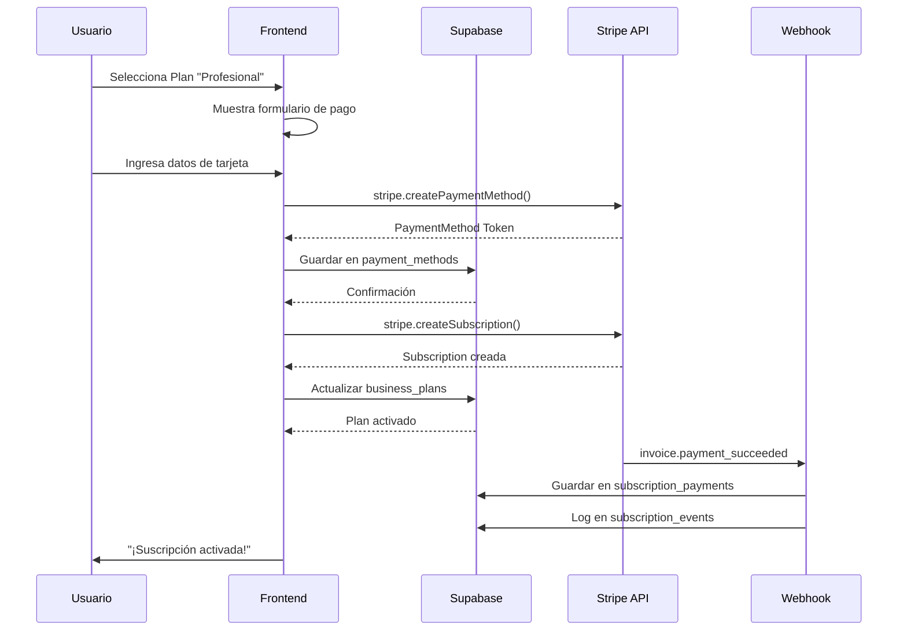
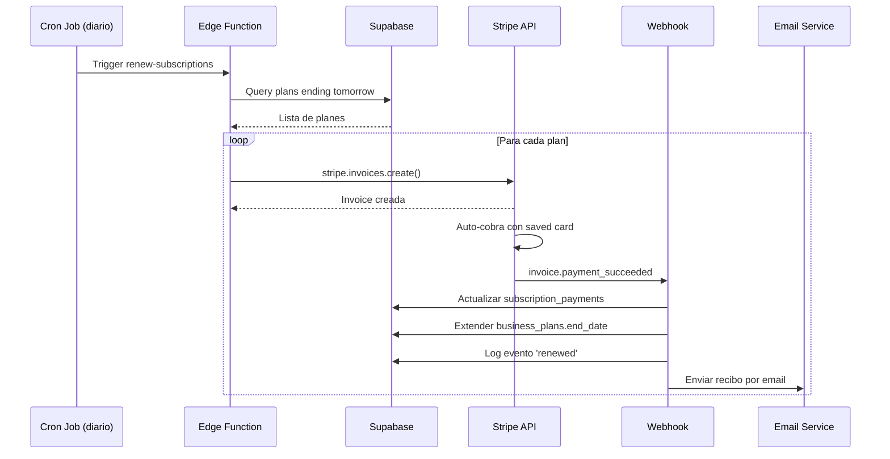
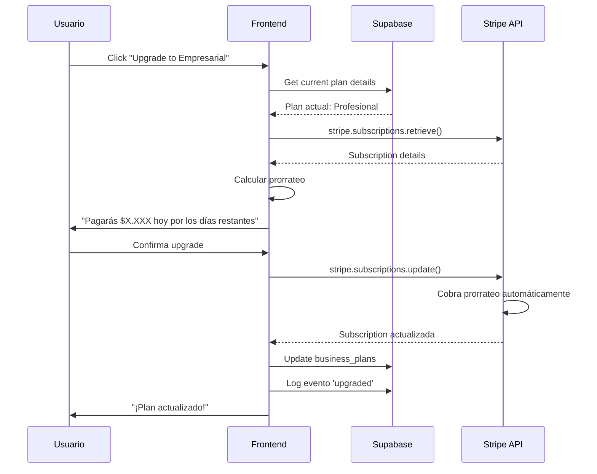
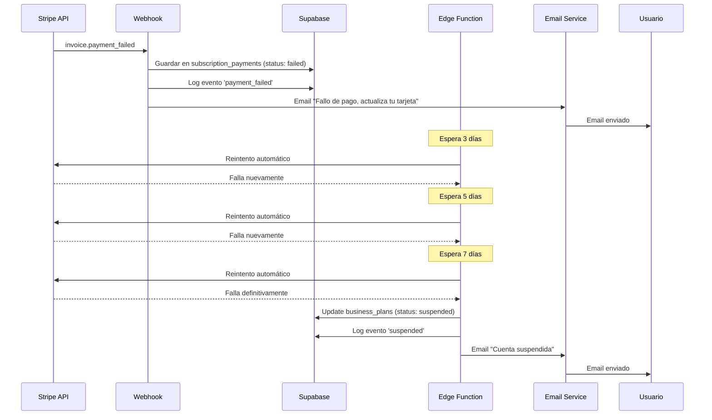
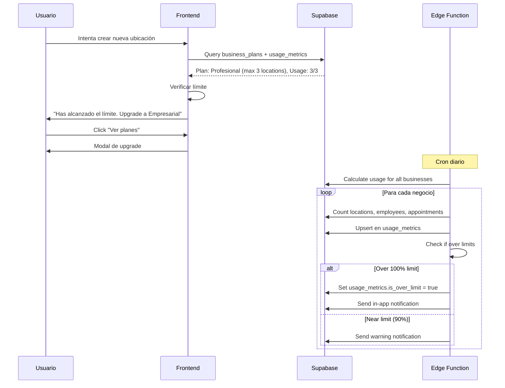

# SISTEMA DE PAGOS Y SUSCRIPCIONES - ANÁLISIS COMPLETO

**Fecha de Análisis:** 13 de octubre de 2025  
**Proyecto:** AppointSync Pro  
**Versión:** 1.0  

---

## 📋 TABLA DE CONTENIDOS

1. [Resumen Ejecutivo](#resumen-ejecutivo)
2. [Análisis de la Infraestructura Actual](#análisis-de-la-infraestructura-actual)
3. [Requerimientos del Sistema](#requerimientos-del-sistema)
4. [Análisis de Pasarelas de Pago para Colombia](#análisis-de-pasarelas-de-pago-para-colombia)
5. [Arquitectura Propuesta](#arquitectura-propuesta)
6. [Esquema de Base de Datos](#esquema-de-base-de-datos)
7. [Flujos de Proceso](#flujos-de-proceso)
8. [Consideraciones de Seguridad](#consideraciones-de-seguridad)
9. [Plan de Implementación](#plan-de-implementación)

---

## 🎯 RESUMEN EJECUTIVO

### Objetivo
Implementar un sistema completo de pagos con tarjeta de débito/crédito, gestión de suscripciones y módulo de facturación para los 4 planes de pricing definidos en AppointSync Pro.

### Alcance
- **Procesamiento de Pagos:** Integración con pasarela de pago para Colombia
- **Gestión de Suscripciones:** Creación, actualización, cancelación y renovación automática
- **Módulo de Facturación:** Historial de pagos, facturas, resumen de plan y consumo
- **Portal de Usuario:** Dashboard accesible para clientes con toda la información de billing

### Planes de Suscripción Existentes

| Plan | Precio Mensual | Precio Anual | Límites Principales |
|------|---------------|--------------|---------------------|
| **Inicio** | $29.900 COP | $322.920 COP | 1 ubicación, 2 empleados, 150 citas/mes |
| **Profesional** | $79.900 COP | $862.920 COP | 3 ubicaciones, 6 empleados, 500 citas/mes |
| **Empresarial** | $149.900 COP | $1.619.280 COP | 10 ubicaciones, 21 empleados, ilimitado |
| **Corporativo** | A cotizar | A cotizar | Todo ilimitado, instancia dedicada |

---

## 🔍 ANÁLISIS DE LA INFRAESTRUCTURA ACTUAL

### ✅ Lo que YA existe en el sistema

#### 1. **Tabla `business_plans`** (Parcialmente Implementada)
**Ubicación:** `src/database/enhanced-schema.sql` (líneas 243-257)

```sql
CREATE TABLE business_plans (
    id UUID PRIMARY KEY DEFAULT uuid_generate_v4(),
    business_id UUID UNIQUE NOT NULL REFERENCES businesses(id) ON DELETE CASCADE,
    plan_type plan_type NOT NULL DEFAULT 'free',
    features TEXT[] DEFAULT ARRAY[]::TEXT[],
    limits JSONB NOT NULL DEFAULT '{}',
    price DECIMAL(10,2) NOT NULL DEFAULT 0,
    currency VARCHAR(3) NOT NULL DEFAULT 'COP',
    billing_cycle VARCHAR(10) DEFAULT 'monthly', -- 'monthly', 'yearly'
    status plan_status DEFAULT 'active',
    start_date TIMESTAMP WITH TIME ZONE DEFAULT NOW(),
    end_date TIMESTAMP WITH TIME ZONE,
    created_at TIMESTAMP WITH TIME ZONE DEFAULT NOW(),
    updated_at TIMESTAMP WITH TIME ZONE DEFAULT NOW()
);
```

**ENUM Types existentes:**
```sql
CREATE TYPE plan_type AS ENUM ('free', 'basic', 'professional', 'enterprise');
CREATE TYPE plan_status AS ENUM ('active', 'cancelled', 'expired', 'suspended');
```

**Análisis:**
- ✅ Estructura básica de planes definida
- ✅ Relación con `businesses` establecida
- ✅ Campos de precio, moneda y ciclo de facturación
- ❌ **Falta:** Tracking de pagos realizados
- ❌ **Falta:** Información de método de pago
- ❌ **Falta:** Historial de cambios de plan
- ❌ **Falta:** Consumo de recursos vs límites

#### 2. **Sistema Fiscal Colombiano** (Completo pero Separado)
**Ubicación:** `supabase/migrations/20251013000000_fiscal_system_colombia.sql`

```sql
CREATE TABLE tax_configurations (
    business_id UUID REFERENCES businesses(id),
    tax_regime tax_regime DEFAULT 'common',
    is_iva_responsible BOOLEAN DEFAULT TRUE,
    default_iva_rate DECIMAL(5,2) DEFAULT 19.00,
    ica_rate DECIMAL(5,4) DEFAULT 0.00,
    retention_rate DECIMAL(5,2) DEFAULT 0.00,
    -- ... más campos fiscales
);

CREATE TABLE invoices (
    invoice_number VARCHAR(50) NOT NULL,
    status invoice_status DEFAULT 'draft',
    client_id UUID REFERENCES profiles(id),
    subtotal DECIMAL(12,2) NOT NULL,
    total_amount DECIMAL(12,2) NOT NULL,
    -- ... facturación para clientes del negocio
);
```

**Análisis:**
- ✅ Sistema completo de facturación DIAN
- ✅ Cálculo automático de IVA, ICA, retención
- ✅ Generación de facturas electrónicas
- ⚠️ **Importante:** Este sistema es para que los negocios facturen a SUS clientes
- ⚠️ **No sirve para:** Facturar las suscripciones de AppointSync Pro a los dueños de negocios

#### 3. **Componentes de Transacciones** (Para negocios, no para suscripciones)
**Ubicación:** `src/components/transactions/`

- `TransactionForm.tsx`: Formulario de ingresos/egresos del negocio
- `EnhancedTransactionForm.tsx`: Con cálculo fiscal automático
- `FinancialDashboard.tsx`: Dashboard financiero del negocio
- `EnhancedFinancialDashboard.tsx`: Con gráficos avanzados

**Payment Methods existentes en transacciones:**
```typescript
const PAYMENT_METHODS = [
  'cash',
  'credit_card',
  'debit_card',
  'bank_transfer',
  'digital_wallet',
  'check',
];
```

**Análisis:**
- ✅ UI existente para formularios de pago
- ✅ Patrones establecidos para manejo de transacciones
- ⚠️ **No aplica directamente:** Estos son para transacciones del negocio con sus clientes
- ✅ **Reutilizable:** Patrones de UI y validaciones

### ❌ Lo que NO existe y DEBE crearse

#### 1. **Almacenamiento de Métodos de Pago**
No existe una tabla para guardar tarjetas de crédito/débito de los dueños de negocios.

**Necesario crear:**
```sql
CREATE TABLE payment_methods (
    id UUID PRIMARY KEY,
    business_id UUID REFERENCES businesses(id),
    type VARCHAR(20), -- 'credit_card', 'debit_card'
    provider VARCHAR(50), -- 'visa', 'mastercard', 'amex'
    last_four VARCHAR(4),
    expiry_month INTEGER,
    expiry_year INTEGER,
    cardholder_name VARCHAR(255),
    is_default BOOLEAN DEFAULT false,
    gateway_customer_id VARCHAR(255), -- ID en Stripe/Wompi/etc
    gateway_payment_method_id VARCHAR(255), -- ID del método en gateway
    created_at TIMESTAMPTZ DEFAULT NOW(),
    updated_at TIMESTAMPTZ DEFAULT NOW()
);
```

#### 2. **Registro de Pagos de Suscripción**
No existe una tabla para el historial de pagos mensuales/anuales.

**Necesario crear:**
```sql
CREATE TABLE subscription_payments (
    id UUID PRIMARY KEY,
    business_id UUID REFERENCES businesses(id),
    plan_id UUID REFERENCES business_plans(id),
    amount DECIMAL(12,2) NOT NULL,
    currency VARCHAR(3) DEFAULT 'COP',
    status VARCHAR(20), -- 'pending', 'completed', 'failed', 'refunded'
    payment_method_id UUID REFERENCES payment_methods(id),
    gateway_transaction_id VARCHAR(255),
    gateway_response JSONB,
    billing_period_start DATE NOT NULL,
    billing_period_end DATE NOT NULL,
    paid_at TIMESTAMPTZ,
    failed_at TIMESTAMPTZ,
    failure_reason TEXT,
    invoice_url TEXT,
    receipt_url TEXT,
    created_at TIMESTAMPTZ DEFAULT NOW()
);
```

#### 3. **Eventos de Suscripción (Audit Trail)**
No existe tracking de cambios en las suscripciones.

**Necesario crear:**
```sql
CREATE TABLE subscription_events (
    id UUID PRIMARY KEY,
    business_id UUID REFERENCES businesses(id),
    plan_id UUID REFERENCES business_plans(id),
    event_type VARCHAR(50), -- 'created', 'upgraded', 'downgraded', 'cancelled', 'renewed', 'expired', 'suspended'
    old_plan_type plan_type,
    new_plan_type plan_type,
    old_price DECIMAL(12,2),
    new_price DECIMAL(12,2),
    reason TEXT,
    metadata JSONB,
    created_by UUID REFERENCES users(id),
    created_at TIMESTAMPTZ DEFAULT NOW()
);
```

#### 4. **Métricas de Uso/Consumo**
No existe tracking de consumo de recursos vs límites del plan.

**Necesario crear:**
```sql
CREATE TABLE usage_metrics (
    id UUID PRIMARY KEY,
    business_id UUID REFERENCES businesses(id),
    plan_id UUID REFERENCES business_plans(id),
    metric_date DATE NOT NULL,
    locations_count INTEGER DEFAULT 0,
    employees_count INTEGER DEFAULT 0,
    appointments_count INTEGER DEFAULT 0,
    clients_count INTEGER DEFAULT 0,
    services_count INTEGER DEFAULT 0,
    storage_mb DECIMAL(10,2) DEFAULT 0,
    api_calls INTEGER DEFAULT 0,
    created_at TIMESTAMPTZ DEFAULT NOW(),
    UNIQUE(business_id, metric_date)
);
```

#### 5. **Componentes UI para Billing**
No existen componentes React para:
- Dashboard de facturación del usuario
- Historial de pagos
- Gestión de métodos de pago (agregar/eliminar tarjetas)
- Resumen de plan actual con límites
- Indicadores de consumo vs límites
- Modal de upgrade/downgrade de plan
- Formulario de pago con integración de gateway

#### 6. **Hooks de Suscripción**
No existen custom hooks para:
- `useSubscription()`: Estado actual del plan
- `usePaymentMethods()`: CRUD de tarjetas
- `usePaymentHistory()`: Historial de pagos
- `useUsageMetrics()`: Consumo actual vs límites
- `useSubscriptionUpgrade()`: Cambio de plan

#### 7. **Edge Functions para Webhooks**
No existen funciones serverless para:
- Manejar webhooks de la pasarela de pago
- Procesar renovaciones automáticas
- Manejar fallos de pago
- Enviar notificaciones de facturación

---

## 📝 REQUERIMIENTOS DEL SISTEMA

### Requerimientos Funcionales

#### RF1: Gestión de Métodos de Pago
- El usuario debe poder agregar tarjetas de crédito/débito
- El usuario debe poder ver sus tarjetas almacenadas (solo últimos 4 dígitos)
- El usuario debe poder eliminar tarjetas
- El usuario debe poder marcar una tarjeta como predeterminada
- Las tarjetas NO deben almacenarse en texto plano (usar tokenización del gateway)

#### RF2: Procesamiento de Pagos
- El sistema debe procesar pagos de suscripción mensual/anual
- El sistema debe manejar pagos únicos (upgrades prorrateados)
- El sistema debe generar recibos de pago automáticamente
- El sistema debe enviar email de confirmación al completar un pago
- El sistema debe reintentar pagos fallidos (máximo 3 intentos)

#### RF3: Gestión de Suscripciones
- El usuario debe poder ver su plan actual y límites
- El usuario debe poder upgradear su plan (con prorrateo)
- El usuario debe poder downgradedar su plan (efectivo al siguiente ciclo)
- El usuario debe poder cancelar su suscripción
- El sistema debe renovar automáticamente las suscripciones activas
- El sistema debe bloquear funcionalidades cuando se exceden límites

#### RF4: Historial y Facturación
- El usuario debe poder ver historial completo de pagos
- El usuario debe poder descargar facturas en PDF
- El usuario debe poder ver consumo actual vs límites del plan
- El usuario debe recibir alertas al acercarse a límites (80%, 90%, 100%)

#### RF5: Panel Administrativo
- Los admins de AppointSync Pro deben ver dashboard de todos los pagos
- Los admins deben poder ver métricas de conversión por plan
- Los admins deben poder aplicar descuentos/cupones
- Los admins deben poder suspender/reactivar suscripciones

### Requerimientos No Funcionales

#### RNF1: Seguridad
- Cumplir con PCI DSS (no almacenar datos completos de tarjetas)
- Usar HTTPS para todas las comunicaciones
- Encriptar datos sensibles en base de datos
- Validar webhooks con firmas criptográficas

#### RNF2: Disponibilidad
- Uptime del sistema de pagos: 99.9%
- Timeout de procesamiento: máximo 30 segundos
- Reintentos automáticos en caso de fallo temporal

#### RNF3: Usabilidad
- Flujo de pago en máximo 3 pasos
- Formularios con validación en tiempo real
- Mensajes de error claros y accionables
- Soporte para responsive design (móvil + desktop)

#### RNF4: Auditoría
- Registrar todos los eventos de suscripción
- Mantener logs de intentos de pago por 7 años (regulación colombiana)
- Trazabilidad completa de cambios de plan

---

## 💳 ANÁLISIS DE PASARELAS DE PAGO PARA COLOMBIA

### Opción 1: **Stripe** ⭐ RECOMENDADA

#### Pros ✅
- **Mejor documentación** del mercado
- **SDK robusto** para JavaScript/TypeScript
- **React components** oficiales (`@stripe/react-stripe-js`)
- **Webhooks confiables** con reintentos automáticos
- **Suscripciones nativas:** Manejo automático de renovaciones, prorrateados, trials
- **PCI compliant** por diseño (nunca tocamos datos de tarjeta)
- **Dashboard excelente** para monitoreo y debugging
- **Soporte de múltiples métodos:** Tarjetas, PSE, transferencias
- **Testing robusto:** Tarjetas de prueba y entorno sandbox completo

#### Contras ❌
- **Comisión más alta:** 3.9% + $900 COP por transacción exitosa
- **Requiere cuenta empresarial** con documentación completa
- **Pagos en USD:** Cobra en dólares aunque factures en COP (hay conversión)

#### Costos Estimados
- Plan Free: $0/mes
- Comisión por transacción: 3.9% + $900 COP
- Sin costos de setup o mantenimiento
- **Ejemplo:** Pago de $79.900 COP = Comisión ~$4.000 COP

#### Integración
```typescript
import { loadStripe } from '@stripe/stripe-js';
import { Elements, CardElement } from '@stripe/react-stripe-js';

const stripePromise = loadStripe('pk_live_xxx');

// Componente de pago
<Elements stripe={stripePromise}>
  <CheckoutForm />
</Elements>
```

#### Webhooks Críticos
- `customer.subscription.created`: Nueva suscripción
- `customer.subscription.updated`: Cambio de plan
- `customer.subscription.deleted`: Cancelación
- `invoice.payment_succeeded`: Pago exitoso
- `invoice.payment_failed`: Pago fallido
- `charge.refunded`: Reembolso procesado

---

### Opción 2: **Wompi** (by Bancolombia)

#### Pros ✅
- **Empresa colombiana** (Bancolombia + Grupo Aval)
- **Comisiones más bajas:** 2.99% + $500 COP
- **Integración local:** Soporte en español
- **PSE incluido:** Débitos bancarios directos
- **Nequi integrado:** Pagos con billetera digital popular en Colombia
- **Documentación en español**

#### Contras ❌
- **SDK menos maduro** que Stripe
- **Menos features de suscripciones:** Hay que implementar más lógica custom
- **Dashboard básico**
- **Documentación limitada** comparada con Stripe
- **Webhooks menos confiables** (reportes de usuarios)

#### Costos Estimados
- Plan Free: $0/mes
- Comisión por transacción: 2.99% + $500 COP
- **Ejemplo:** Pago de $79.900 COP = Comisión ~$2.900 COP

#### Integración
```typescript
import { WompiWidget } from '@wompi/wompi-widget';

const checkout = new WompiWidget({
  currency: 'COP',
  amountInCents: 7990000, // $79.900 COP
  reference: 'subscription_123',
  publicKey: 'pub_test_xxx'
});
```

---

### Opción 3: **Mercado Pago**

#### Pros ✅
- **Presencia regional fuerte** (MercadoLibre)
- **Múltiples métodos:** Tarjetas, efectivo, débito
- **SDK completo** para Node.js y React
- **Suscripciones nativas**
- **Wallet integrado:** Usuarios pueden pagar con saldo de Mercado Pago

#### Contras ❌
- **Comisiones altas:** 3.99% + $700 COP
- **Marca asociada a e-commerce:** Puede no ser ideal para SaaS B2B
- **Documentación confusa** en algunos puntos
- **Menos enfocado en SaaS** que Stripe

#### Costos Estimados
- Plan Free: $0/mes
- Comisión por transacción: 3.99% + $700 COP
- **Ejemplo:** Pago de $79.900 COP = Comisión ~$3.900 COP

---

### Opción 4: **PayU Latam**

#### Pros ✅
- **Especializado en Latinoamérica**
- **Soporta múltiples países** (bueno para expansión)
- **Pagos recurrentes nativos**
- **Integración con bancos locales**

#### Contras ❌
- **SDK desactualizado:** Última versión de hace 2+ años
- **Documentación pobre**
- **Comisiones altas:** 3.49% + $900 COP
- **Dashboard anticuado**
- **Soporte técnico lento** (reportes de usuarios)

---

### Comparativa Final

| Característica | Stripe | Wompi | Mercado Pago | PayU |
|----------------|--------|-------|--------------|------|
| **Comisión** | 3.9% + $900 | 2.99% + $500 | 3.99% + $700 | 3.49% + $900 |
| **SDK Quality** | ⭐⭐⭐⭐⭐ | ⭐⭐⭐ | ⭐⭐⭐⭐ | ⭐⭐ |
| **Documentación** | ⭐⭐⭐⭐⭐ | ⭐⭐⭐ | ⭐⭐⭐ | ⭐⭐ |
| **Suscripciones** | Nativas | Básicas | Nativas | Nativas |
| **Webhooks** | ⭐⭐⭐⭐⭐ | ⭐⭐⭐ | ⭐⭐⭐⭐ | ⭐⭐⭐ |
| **Dashboard** | ⭐⭐⭐⭐⭐ | ⭐⭐⭐ | ⭐⭐⭐⭐ | ⭐⭐ |
| **PCI Compliance** | ✅ | ✅ | ✅ | ✅ |
| **PSE (Débito)** | ✅ | ✅ | ✅ | ✅ |
| **Testing** | ⭐⭐⭐⭐⭐ | ⭐⭐⭐ | ⭐⭐⭐⭐ | ⭐⭐ |

### ✅ RECOMENDACIÓN: **STRIPE**

**Razones:**
1. **Mejor DX (Developer Experience):** Documentación, SDK, y React components de primer nivel
2. **Suscripciones robustas:** Sistema probado por miles de SaaS
3. **Webhooks confiables:** Crítico para renovaciones automáticas
4. **Escalabilidad:** Cuando crezcamos, soporta volúmenes enterprise
5. **Testing completo:** Podemos probar todo antes de ir a producción
6. **Soporte 24/7:** Chat en vivo para resolver issues rápido

**Trade-off:**
- Comisión ~$1.100 COP más cara por transacción que Wompi
- Para 100 suscripciones/mes: $110.000 COP más caro/mes
- **Vale la pena** por la robustez y confiabilidad

**Plan de Contingencia:**
- Diseñar capa de abstracción `PaymentGateway` interface
- Si en el futuro necesitamos cambiar, podemos switchear provider sin reescribir todo

---

## 🏗️ ARQUITECTURA PROPUESTA

### Diagrama de Componentes

```
┌─────────────────────────────────────────────────────────────┐
│                      FRONTEND (React)                        │
├─────────────────────────────────────────────────────────────┤
│  ┌──────────────────┐  ┌──────────────────┐                │
│  │  Billing         │  │  Payment         │                │
│  │  Dashboard       │  │  Methods         │                │
│  │  Component       │  │  Manager         │                │
│  └──────────────────┘  └──────────────────┘                │
│                                                              │
│  ┌──────────────────┐  ┌──────────────────┐                │
│  │  Usage           │  │  Plan            │                │
│  │  Metrics         │  │  Upgrade         │                │
│  │  Widget          │  │  Modal           │                │
│  └──────────────────┘  └──────────────────┘                │
└─────────────────────────────────────────────────────────────┘
                          │
                          ▼
┌─────────────────────────────────────────────────────────────┐
│                    CUSTOM HOOKS                              │
├─────────────────────────────────────────────────────────────┤
│  • useSubscription()        • usePaymentMethods()           │
│  • usePaymentHistory()      • useUsageMetrics()             │
│  • useSubscriptionUpgrade() • usePlanLimits()               │
└─────────────────────────────────────────────────────────────┘
                          │
                          ▼
┌─────────────────────────────────────────────────────────────┐
│                  SUPABASE CLIENT                             │
├─────────────────────────────────────────────────────────────┤
│  • RPC Functions                                             │
│  • Row Level Security                                        │
│  • Realtime Subscriptions (para updates de plan)            │
└─────────────────────────────────────────────────────────────┘
                          │
                          ▼
┌─────────────────────────────────────────────────────────────┐
│                  SUPABASE EDGE FUNCTIONS                     │
├─────────────────────────────────────────────────────────────┤
│  ┌──────────────────┐  ┌──────────────────┐                │
│  │  stripe-webhook  │  │  process-payment │                │
│  │  handler         │  │  handler         │                │
│  └──────────────────┘  └──────────────────┘                │
│                                                              │
│  ┌──────────────────┐  ┌──────────────────┐                │
│  │  renew-          │  │  calculate-      │                │
│  │  subscriptions   │  │  usage           │                │
│  └──────────────────┘  └──────────────────┘                │
└─────────────────────────────────────────────────────────────┘
                          │
                          ▼
┌─────────────────────────────────────────────────────────────┐
│                    STRIPE API                                │
├─────────────────────────────────────────────────────────────┤
│  • Customer Management                                       │
│  • Payment Method Storage                                    │
│  • Subscription Management                                   │
│  • Invoice Generation                                        │
│  • Webhook Events                                            │
└─────────────────────────────────────────────────────────────┘
                          │
                          ▼
┌─────────────────────────────────────────────────────────────┐
│                  POSTGRESQL (Supabase)                       │
├─────────────────────────────────────────────────────────────┤
│  • business_plans                                            │
│  • payment_methods                                           │
│  • subscription_payments                                     │
│  • subscription_events                                       │
│  • usage_metrics                                             │
└─────────────────────────────────────────────────────────────┘
```

### Flujo de Datos

#### 1. Agregar Método de Pago
```
Usuario → PaymentMethodForm → Stripe Elements → Stripe API
                                                     ↓
                                            Create PaymentMethod
                                                     ↓
                          ← Return PaymentMethod Token ←
                                                     ↓
                          → Save to payment_methods table →
                                                     ↓
                          ← Confirm saved → Show success
```

#### 2. Procesar Pago de Suscripción
```
Sistema Cron (diario) → Check upcoming renewals →
                                                     ↓
                          Edge Function: renew-subscriptions
                                                     ↓
                          → Stripe API: Create Invoice →
                                                     ↓
                          ← Stripe charges card automatically ←
                                                     ↓
                          Webhook: invoice.payment_succeeded
                                                     ↓
                          Edge Function: stripe-webhook →
                                                     ↓
                          → Save to subscription_payments →
                                                     ↓
                          → Update business_plans.end_date →
                                                     ↓
                          → Send email receipt →
```

#### 3. Upgrade de Plan
```
Usuario → Clicks "Upgrade to Pro" →
                                                     ↓
                          Modal: Confirm new plan + proration
                                                     ↓
                          → Calculate proration →
                                                     ↓
                          → Stripe API: Update Subscription →
                                                     ↓
                          ← Stripe charges prorated amount ←
                                                     ↓
                          → Update business_plans table →
                                                     ↓
                          → Log to subscription_events →
                                                     ↓
                          → Show success message →
```

---

## 🗄️ ESQUEMA DE BASE DE DATOS

### Tablas Nuevas a Crear

#### 1. `payment_methods`
```sql
CREATE TABLE payment_methods (
    id UUID PRIMARY KEY DEFAULT uuid_generate_v4(),
    business_id UUID NOT NULL REFERENCES businesses(id) ON DELETE CASCADE,
    
    -- Información de la tarjeta (solo metadatos, no datos sensibles)
    type VARCHAR(20) NOT NULL CHECK (type IN ('credit_card', 'debit_card')),
    provider VARCHAR(50) NOT NULL, -- 'visa', 'mastercard', 'amex', 'diners'
    last_four VARCHAR(4) NOT NULL,
    expiry_month INTEGER NOT NULL CHECK (expiry_month BETWEEN 1 AND 12),
    expiry_year INTEGER NOT NULL CHECK (expiry_year >= EXTRACT(YEAR FROM CURRENT_DATE)),
    cardholder_name VARCHAR(255) NOT NULL,
    
    -- Billing address
    billing_address_line1 VARCHAR(255),
    billing_address_line2 VARCHAR(255),
    billing_city VARCHAR(100),
    billing_state VARCHAR(100),
    billing_country VARCHAR(3) DEFAULT 'COL',
    billing_postal_code VARCHAR(20),
    
    -- Gateway integration
    gateway_customer_id VARCHAR(255), -- Stripe Customer ID
    gateway_payment_method_id VARCHAR(255) NOT NULL, -- Stripe PaymentMethod ID
    gateway_fingerprint VARCHAR(255), -- Para detectar duplicados
    
    -- Status
    is_default BOOLEAN DEFAULT false,
    is_verified BOOLEAN DEFAULT false,
    is_active BOOLEAN DEFAULT true,
    
    -- Metadata
    metadata JSONB DEFAULT '{}',
    created_at TIMESTAMPTZ DEFAULT NOW(),
    updated_at TIMESTAMPTZ DEFAULT NOW(),
    
    -- Constraints
    CONSTRAINT unique_default_per_business UNIQUE (business_id, is_default) WHERE is_default = true
);

CREATE INDEX idx_payment_methods_business_id ON payment_methods(business_id);
CREATE INDEX idx_payment_methods_gateway_customer ON payment_methods(gateway_customer_id);
```

#### 2. `subscription_payments`
```sql
CREATE TABLE subscription_payments (
    id UUID PRIMARY KEY DEFAULT uuid_generate_v4(),
    business_id UUID NOT NULL REFERENCES businesses(id) ON DELETE CASCADE,
    plan_id UUID NOT NULL REFERENCES business_plans(id) ON DELETE CASCADE,
    
    -- Payment details
    amount DECIMAL(12,2) NOT NULL CHECK (amount >= 0),
    currency VARCHAR(3) NOT NULL DEFAULT 'COP',
    status VARCHAR(20) NOT NULL CHECK (status IN (
        'pending', 'processing', 'completed', 'failed', 'refunded', 'cancelled'
    )),
    
    -- Payment method used
    payment_method_id UUID REFERENCES payment_methods(id) ON DELETE SET NULL,
    
    -- Gateway integration
    gateway_transaction_id VARCHAR(255) UNIQUE,
    gateway_invoice_id VARCHAR(255),
    gateway_charge_id VARCHAR(255),
    gateway_response JSONB,
    
    -- Billing period
    billing_period_start DATE NOT NULL,
    billing_period_end DATE NOT NULL,
    
    -- Timestamps
    attempted_at TIMESTAMPTZ,
    paid_at TIMESTAMPTZ,
    failed_at TIMESTAMPTZ,
    refunded_at TIMESTAMPTZ,
    
    -- Error handling
    failure_reason TEXT,
    retry_count INTEGER DEFAULT 0,
    next_retry_at TIMESTAMPTZ,
    
    -- Documents
    invoice_url TEXT,
    receipt_url TEXT,
    invoice_pdf BYTEA, -- Opcional: almacenar PDF localmente
    
    -- Metadata
    description TEXT,
    metadata JSONB DEFAULT '{}',
    created_at TIMESTAMPTZ DEFAULT NOW(),
    updated_at TIMESTAMPTZ DEFAULT NOW()
);

CREATE INDEX idx_subscription_payments_business_id ON subscription_payments(business_id);
CREATE INDEX idx_subscription_payments_plan_id ON subscription_payments(plan_id);
CREATE INDEX idx_subscription_payments_status ON subscription_payments(status);
CREATE INDEX idx_subscription_payments_billing_period ON subscription_payments(billing_period_start, billing_period_end);
CREATE INDEX idx_subscription_payments_gateway_transaction ON subscription_payments(gateway_transaction_id);
```

#### 3. `subscription_events`
```sql
CREATE TABLE subscription_events (
    id UUID PRIMARY KEY DEFAULT uuid_generate_v4(),
    business_id UUID NOT NULL REFERENCES businesses(id) ON DELETE CASCADE,
    plan_id UUID NOT NULL REFERENCES business_plans(id) ON DELETE CASCADE,
    
    -- Event details
    event_type VARCHAR(50) NOT NULL CHECK (event_type IN (
        'created', 'activated', 'upgraded', 'downgraded', 
        'renewed', 'cancelled', 'expired', 'suspended', 'reactivated',
        'payment_failed', 'payment_succeeded', 'trial_started', 'trial_ended'
    )),
    
    -- Plan changes
    old_plan_type plan_type,
    new_plan_type plan_type,
    old_price DECIMAL(12,2),
    new_price DECIMAL(12,2),
    old_billing_cycle VARCHAR(10),
    new_billing_cycle VARCHAR(10),
    
    -- Context
    reason TEXT,
    notes TEXT,
    triggered_by VARCHAR(20) CHECK (triggered_by IN ('user', 'system', 'admin', 'webhook')),
    
    -- Related records
    payment_id UUID REFERENCES subscription_payments(id),
    created_by UUID REFERENCES users(id),
    
    -- Metadata
    metadata JSONB DEFAULT '{}',
    created_at TIMESTAMPTZ DEFAULT NOW()
);

CREATE INDEX idx_subscription_events_business_id ON subscription_events(business_id);
CREATE INDEX idx_subscription_events_plan_id ON subscription_events(plan_id);
CREATE INDEX idx_subscription_events_event_type ON subscription_events(event_type);
CREATE INDEX idx_subscription_events_created_at ON subscription_events(created_at DESC);
```

#### 4. `usage_metrics`
```sql
CREATE TABLE usage_metrics (
    id UUID PRIMARY KEY DEFAULT uuid_generate_v4(),
    business_id UUID NOT NULL REFERENCES businesses(id) ON DELETE CASCADE,
    plan_id UUID NOT NULL REFERENCES business_plans(id) ON DELETE CASCADE,
    
    -- Date for the metrics
    metric_date DATE NOT NULL,
    
    -- Core usage
    locations_count INTEGER DEFAULT 0 CHECK (locations_count >= 0),
    employees_count INTEGER DEFAULT 0 CHECK (employees_count >= 0),
    appointments_count INTEGER DEFAULT 0 CHECK (appointments_count >= 0),
    clients_count INTEGER DEFAULT 0 CHECK (clients_count >= 0),
    services_count INTEGER DEFAULT 0 CHECK (services_count >= 0),
    
    -- Storage
    storage_mb DECIMAL(10,2) DEFAULT 0 CHECK (storage_mb >= 0),
    
    -- API usage (for enterprise plans)
    api_calls INTEGER DEFAULT 0 CHECK (api_calls >= 0),
    
    -- Advanced features usage
    invoices_generated INTEGER DEFAULT 0,
    reports_exported INTEGER DEFAULT 0,
    notifications_sent INTEGER DEFAULT 0,
    
    -- Calculated fields
    is_over_limit BOOLEAN DEFAULT false,
    limit_exceeded_resources TEXT[], -- ['locations', 'appointments']
    
    -- Metadata
    metadata JSONB DEFAULT '{}',
    created_at TIMESTAMPTZ DEFAULT NOW(),
    updated_at TIMESTAMPTZ DEFAULT NOW(),
    
    -- Constraints
    UNIQUE(business_id, metric_date)
);

CREATE INDEX idx_usage_metrics_business_id ON usage_metrics(business_id);
CREATE INDEX idx_usage_metrics_plan_id ON usage_metrics(plan_id);
CREATE INDEX idx_usage_metrics_date ON usage_metrics(metric_date DESC);
CREATE INDEX idx_usage_metrics_over_limit ON usage_metrics(is_over_limit) WHERE is_over_limit = true;
```

#### 5. `discount_codes` (Bonus: Sistema de cupones)
```sql
CREATE TABLE discount_codes (
    id UUID PRIMARY KEY DEFAULT uuid_generate_v4(),
    code VARCHAR(50) NOT NULL UNIQUE,
    description TEXT,
    
    -- Discount details
    discount_type VARCHAR(20) NOT NULL CHECK (discount_type IN ('percentage', 'fixed_amount')),
    discount_value DECIMAL(10,2) NOT NULL CHECK (discount_value > 0),
    currency VARCHAR(3) DEFAULT 'COP', -- Solo para fixed_amount
    
    -- Applicability
    applicable_plans plan_type[], -- NULL = all plans
    min_billing_cycle VARCHAR(10), -- 'monthly', 'yearly', NULL = any
    
    -- Limits
    max_uses INTEGER, -- NULL = unlimited
    uses_count INTEGER DEFAULT 0,
    max_uses_per_business INTEGER DEFAULT 1,
    
    -- Validity
    valid_from TIMESTAMPTZ DEFAULT NOW(),
    valid_until TIMESTAMPTZ,
    is_active BOOLEAN DEFAULT true,
    
    -- Metadata
    created_by UUID REFERENCES users(id),
    metadata JSONB DEFAULT '{}',
    created_at TIMESTAMPTZ DEFAULT NOW(),
    updated_at TIMESTAMPTZ DEFAULT NOW()
);

CREATE INDEX idx_discount_codes_code ON discount_codes(code);
CREATE INDEX idx_discount_codes_active ON discount_codes(is_active) WHERE is_active = true;
```

#### 6. `discount_code_uses`
```sql
CREATE TABLE discount_code_uses (
    id UUID PRIMARY KEY DEFAULT uuid_generate_v4(),
    discount_code_id UUID NOT NULL REFERENCES discount_codes(id) ON DELETE CASCADE,
    business_id UUID NOT NULL REFERENCES businesses(id) ON DELETE CASCADE,
    payment_id UUID REFERENCES subscription_payments(id),
    
    -- Discount applied
    discount_amount DECIMAL(12,2) NOT NULL,
    original_amount DECIMAL(12,2) NOT NULL,
    final_amount DECIMAL(12,2) NOT NULL,
    
    -- Metadata
    created_at TIMESTAMPTZ DEFAULT NOW(),
    
    -- Constraints
    UNIQUE(discount_code_id, business_id) -- Un negocio solo puede usar un código una vez
);

CREATE INDEX idx_discount_code_uses_code ON discount_code_uses(discount_code_id);
CREATE INDEX idx_discount_code_uses_business ON discount_code_uses(business_id);
```

### Modificaciones a Tablas Existentes

#### Actualizar `business_plans`
```sql
-- Agregar campos adicionales
ALTER TABLE business_plans ADD COLUMN IF NOT EXISTS stripe_subscription_id VARCHAR(255) UNIQUE;
ALTER TABLE business_plans ADD COLUMN IF NOT EXISTS stripe_customer_id VARCHAR(255);
ALTER TABLE business_plans ADD COLUMN IF NOT EXISTS trial_ends_at TIMESTAMPTZ;
ALTER TABLE business_plans ADD COLUMN IF NOT EXISTS auto_renew BOOLEAN DEFAULT true;
ALTER TABLE business_plans ADD COLUMN IF NOT EXISTS cancellation_reason TEXT;
ALTER TABLE business_plans ADD COLUMN IF NOT EXISTS cancelled_at TIMESTAMPTZ;
ALTER TABLE business_plans ADD COLUMN IF NOT EXISTS grace_period_ends_at TIMESTAMPTZ;

-- Crear índices
CREATE INDEX IF NOT EXISTS idx_business_plans_stripe_subscription ON business_plans(stripe_subscription_id);
CREATE INDEX IF NOT EXISTS idx_business_plans_stripe_customer ON business_plans(stripe_customer_id);
CREATE INDEX IF NOT EXISTS idx_business_plans_status ON business_plans(status);
CREATE INDEX IF NOT EXISTS idx_business_plans_end_date ON business_plans(end_date) WHERE end_date IS NOT NULL;
```

### Row Level Security (RLS) Policies

```sql
-- payment_methods: Solo el dueño del negocio puede ver/editar
ALTER TABLE payment_methods ENABLE ROW LEVEL SECURITY;

CREATE POLICY "Users can view their business payment methods"
    ON payment_methods FOR SELECT
    USING (
        business_id IN (
            SELECT id FROM businesses WHERE owner_id = auth.uid()
        )
    );

CREATE POLICY "Users can insert payment methods for their business"
    ON payment_methods FOR INSERT
    WITH CHECK (
        business_id IN (
            SELECT id FROM businesses WHERE owner_id = auth.uid()
        )
    );

CREATE POLICY "Users can update their business payment methods"
    ON payment_methods FOR UPDATE
    USING (
        business_id IN (
            SELECT id FROM businesses WHERE owner_id = auth.uid()
        )
    );

-- subscription_payments: Solo lectura para dueños
ALTER TABLE subscription_payments ENABLE ROW LEVEL SECURITY;

CREATE POLICY "Users can view their subscription payments"
    ON subscription_payments FOR SELECT
    USING (
        business_id IN (
            SELECT id FROM businesses WHERE owner_id = auth.uid()
        )
    );

-- subscription_events: Solo lectura para dueños
ALTER TABLE subscription_events ENABLE ROW LEVEL SECURITY;

CREATE POLICY "Users can view their subscription events"
    ON subscription_events FOR SELECT
    USING (
        business_id IN (
            SELECT id FROM businesses WHERE owner_id = auth.uid()
        )
    );

-- usage_metrics: Solo lectura para dueños
ALTER TABLE usage_metrics ENABLE ROW LEVEL SECURITY;

CREATE POLICY "Users can view their usage metrics"
    ON usage_metrics FOR SELECT
    USING (
        business_id IN (
            SELECT id FROM businesses WHERE owner_id = auth.uid()
        )
    );
```

---

## 🔄 FLUJOS DE PROCESO

### Flujo 1: Nuevo Usuario se Suscribe



### Flujo 2: Renovación Automática Mensual



### Flujo 3: Upgrade de Plan (con Prorrateo)



### Flujo 4: Fallo de Pago (con Reintentos)



### Flujo 5: Chequeo de Límites de Plan



---

## 🔒 CONSIDERACIONES DE SEGURIDAD

### 1. PCI DSS Compliance

**Regla de Oro:** NUNCA almacenar datos completos de tarjeta

✅ **Lo que SÍ podemos almacenar:**
- Últimos 4 dígitos
- Mes y año de expiración
- Nombre del titular
- Tipo de tarjeta (Visa, Mastercard)
- Gateway token/ID

❌ **Lo que NUNCA debemos almacenar:**
- Número completo de tarjeta
- CVV/CVC
- PIN
- Datos magnéticos

**Solución:** Usar Stripe Elements
- El formulario de tarjeta es un iframe de Stripe
- Los datos de tarjeta NUNCA pasan por nuestro servidor
- Stripe nos devuelve solo un token seguro
- Somos PCI compliant por diseño

```typescript
// CORRECTO: Usando Stripe Elements
import { CardElement } from '@stripe/react-stripe-js';

const CheckoutForm = () => {
  const stripe = useStripe();
  const elements = useElements();

  const handleSubmit = async (e) => {
    e.preventDefault();
    
    // Stripe maneja los datos de tarjeta, nosotros solo obtenemos el token
    const { paymentMethod, error } = await stripe.createPaymentMethod({
      type: 'card',
      card: elements.getElement(CardElement),
    });
    
    if (!error) {
      // Enviar solo el paymentMethod.id a nuestro backend
      await savePaymentMethod(paymentMethod.id);
    }
  };
  
  return (
    <form onSubmit={handleSubmit}>
      <CardElement /> {/* Este es un iframe seguro de Stripe */}
      <button>Agregar Tarjeta</button>
    </form>
  );
};
```

### 2. Validación de Webhooks

**Problema:** Cualquiera podría enviar un POST a nuestro webhook endpoint

**Solución:** Validar firma criptográfica de Stripe

```typescript
// supabase/functions/stripe-webhook/index.ts
import Stripe from 'stripe';

Deno.serve(async (req) => {
  const signature = req.headers.get('stripe-signature');
  const body = await req.text();
  
  const stripe = new Stripe(Deno.env.get('STRIPE_SECRET_KEY')!);
  
  try {
    // Stripe valida que el webhook realmente venga de ellos
    const event = stripe.webhooks.constructEvent(
      body,
      signature!,
      Deno.env.get('STRIPE_WEBHOOK_SECRET')!
    );
    
    // Ahora podemos confiar en el evento
    if (event.type === 'invoice.payment_succeeded') {
      await handlePaymentSuccess(event.data.object);
    }
    
    return new Response(JSON.stringify({ received: true }), { status: 200 });
  } catch (err) {
    // Firma inválida = posible ataque
    console.error('Webhook signature verification failed:', err);
    return new Response('Unauthorized', { status: 401 });
  }
});
```

### 3. Row Level Security (RLS)

**Problema:** Un usuario podría intentar ver pagos de otro negocio

**Solución:** RLS en Supabase

```sql
-- Un usuario solo puede ver pagos de sus propios negocios
CREATE POLICY "Users can only view their own payments"
ON subscription_payments FOR SELECT
USING (
  business_id IN (
    SELECT id FROM businesses 
    WHERE owner_id = auth.uid()
  )
);

-- Prevenir modificaciones directas desde cliente
CREATE POLICY "No direct updates to payments"
ON subscription_payments FOR UPDATE
USING (false); -- Solo Edge Functions pueden actualizar
```

### 4. Variables de Entorno Seguras

**Nunca commits secrets al repo**

```typescript
// ❌ MAL: Hardcodear keys
const stripe = new Stripe('sk_live_ABC123...');

// ✅ BIEN: Usar variables de entorno
const stripe = new Stripe(Deno.env.get('STRIPE_SECRET_KEY')!);
```

**Setup en Supabase:**
```bash
# Configurar secrets en Supabase CLI
supabase secrets set STRIPE_SECRET_KEY=sk_live_xxx
supabase secrets set STRIPE_WEBHOOK_SECRET=whsec_xxx
supabase secrets set STRIPE_PUBLISHABLE_KEY=pk_live_xxx
```

### 5. Rate Limiting

**Problema:** Ataques de fuerza bruta en endpoints de pago

**Solución:** Rate limiting en Edge Functions

```typescript
// supabase/functions/_shared/rate-limit.ts
import { createClient } from '@supabase/supabase-js';

const rateLimitCache = new Map();

export async function checkRateLimit(
  identifier: string, 
  maxRequests: number = 10,
  windowMs: number = 60000 // 1 minuto
): Promise<boolean> {
  const now = Date.now();
  const userRequests = rateLimitCache.get(identifier) || [];
  
  // Limpiar requests viejos
  const recentRequests = userRequests.filter(
    (timestamp: number) => now - timestamp < windowMs
  );
  
  if (recentRequests.length >= maxRequests) {
    return false; // Rate limit exceeded
  }
  
  recentRequests.push(now);
  rateLimitCache.set(identifier, recentRequests);
  return true;
}
```

### 6. Auditoría y Logging

**Registrar TODOS los eventos críticos**

```typescript
// Función helper para logs de auditoría
async function logAuditEvent(params: {
  businessId: string;
  eventType: string;
  details: Record<string, any>;
  userId?: string;
}) {
  await supabase.from('subscription_events').insert({
    business_id: params.businessId,
    event_type: params.eventType,
    metadata: params.details,
    created_by: params.userId,
    triggered_by: params.userId ? 'user' : 'system',
  });
}

// Uso
await logAuditEvent({
  businessId: '...',
  eventType: 'payment_method_added',
  details: {
    last_four: '4242',
    card_type: 'visa',
    ip_address: req.headers.get('x-forwarded-for'),
  },
  userId: user.id,
});
```

---

## 📅 PLAN DE IMPLEMENTACIÓN

Ver archivo separado: `SISTEMA_PAGOS_Y_SUSCRIPCIONES_PLAN_ACCION.md`

---

## 📊 MÉTRICAS DE ÉXITO

### KPIs Técnicos
- **Uptime del sistema de pagos:** 99.9%
- **Tiempo de procesamiento promedio:** < 5 segundos
- **Tasa de éxito de webhooks:** > 99%
- **Falsos positivos de fraude:** < 1%

### KPIs de Negocio
- **Tasa de conversión Free → Paid:** Target 15%
- **Churn rate mensual:** < 5%
- **MRR (Monthly Recurring Revenue):** Tracking
- **Tasa de upgrade:** > 10% de usuarios paid

### KPIs de UX
- **Tiempo para completar pago:** < 2 minutos
- **Tasa de abandono en checkout:** < 20%
- **CSAT (Customer Satisfaction) en billing:** > 4/5

---

## 🎓 CONCLUSIONES DEL ANÁLISIS

### Fortalezas del Proyecto
1. ✅ Base de datos bien estructurada con `business_plans` existente
2. ✅ Sistema fiscal colombiano completo y funcional
3. ✅ Componentes UI reutilizables para forms y dashboards
4. ✅ Infraestructura Supabase robusta con RLS

### Brechas Identificadas
1. ❌ Falta toda la capa de integración con pasarela de pago
2. ❌ No existe almacenamiento de métodos de pago
3. ❌ No hay tracking de pagos de suscripción
4. ❌ Falta sistema de métricas de uso vs límites
5. ❌ No existen componentes UI para billing dashboard

### Riesgos Técnicos
1. **Complejidad de webhooks:** Requiere manejo robusto de reintentos
2. **Prorrateo de planes:** Cálculos complejos para upgrades
3. **Sincronización Stripe ↔ DB:** Mantener consistencia
4. **Testing de pagos:** Requiere ambiente sandbox completo

### Recomendaciones
1. **Fase 1:** Enfocarse en flujo básico (agregar tarjeta + procesar pago)
2. **Fase 2:** Implementar suscripciones recurrentes + webhooks
3. **Fase 3:** Agregar métricas de uso + límites + upgrades
4. **Fase 4:** Optimizaciones y features avanzadas (cupones, trials)

### Estimación de Esfuerzo
- **Total:** 180-220 horas
- **Duración estimada:** 6-8 semanas (1 desarrollador)
- **Prioridad:** ALTA (Core para monetización)

---

## 📚 REFERENCIAS Y RECURSOS

### Documentación Oficial
- [Stripe Docs](https://stripe.com/docs)
- [Stripe Subscriptions Guide](https://stripe.com/docs/billing/subscriptions/overview)
- [Stripe React Integration](https://stripe.com/docs/stripe-js/react)
- [Supabase Edge Functions](https://supabase.com/docs/guides/functions)
- [Supabase RLS](https://supabase.com/docs/guides/auth/row-level-security)

### Ejemplos de Código
- [Stripe Samples GitHub](https://github.com/stripe-samples)
- [SaaS Starter with Stripe](https://github.com/vercel/nextjs-subscription-payments)

### Normativa Colombia
- [Estatuto Tributario - IVA](https://www.dian.gov.co/)
- [Resolución Facturación Electrónica](https://www.dian.gov.co/normatividad/Paginas/default.aspx)

---

**Documento generado por:** GitHub Copilot  
**Fecha:** 13 de octubre de 2025  
**Próximo paso:** Revisar con stakeholders y aprobar para implementación
