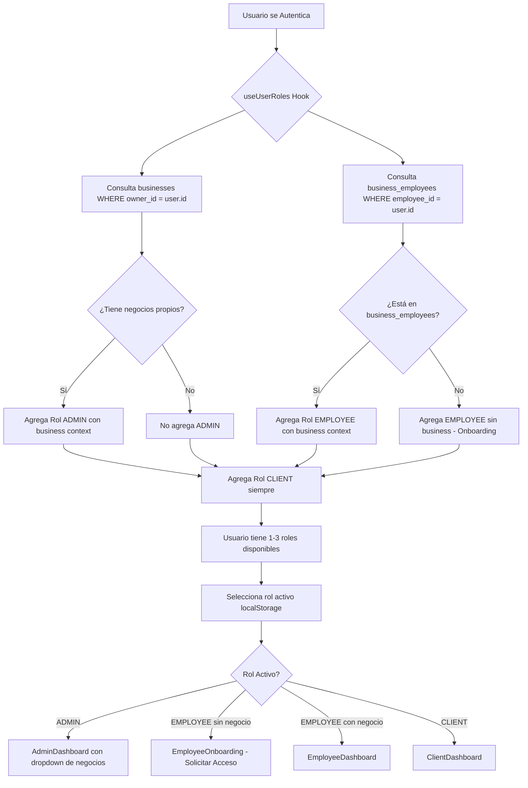
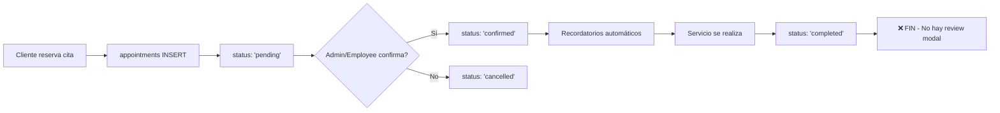
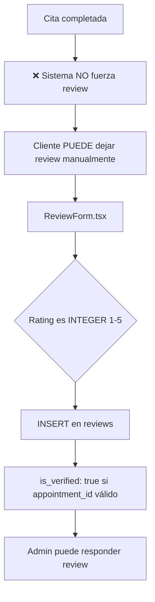
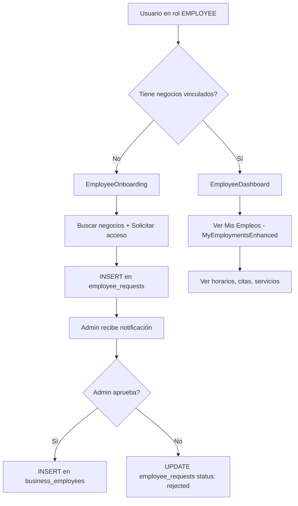
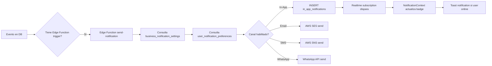
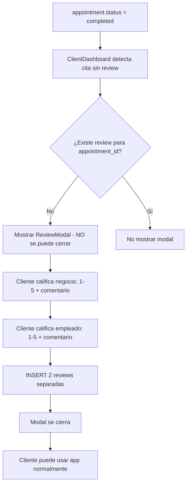

# Análisis Exhaustivo del Sistema de Vacantes Laborales
## AppointSync Pro - Sistema de Gestión de Citas y Empleos

**Fecha**: 17 de Octubre de 2025  
**Versión**: 1.0  
**Autor**: Análisis Técnico AppointSync Pro

---

## 📋 Tabla de Contenidos

1. [Resumen Ejecutivo](#resumen-ejecutivo)
2. [Arquitectura Actual](#arquitectura-actual)
3. [Modelo de Datos](#modelo-de-datos)
4. [Flujos de Usuario](#flujos-de-usuario)
5. [Sistema de Roles](#sistema-de-roles)
6. [Sistema de Notificaciones](#sistema-de-notificaciones)
7. [Sistema de Reviews](#sistema-de-reviews)
8. [Componentes Existentes](#componentes-existentes)
9. [Hooks y Servicios](#hooks-y-servicios)
10. [Análisis de Requerimientos](#análisis-de-requerimientos)
11. [Gaps y Oportunidades](#gaps-y-oportunidades)
12. [Conclusiones](#conclusiones)

---

## 1. Resumen Ejecutivo

AppointSync Pro es una aplicación monorepo multi-plataforma (Web/React + Vite, Móvil/Expo, Extensión de Navegador) con backend en Supabase Cloud. El sistema gestiona citas, negocios, empleados y clientes con un modelo de roles dinámicos.

**Estado Actual del Sistema de Vacantes**:
- ✅ **Tablas en DB**: `job_vacancies` y `job_applications` ya existen
- ✅ **Componentes UI**: 6 componentes base en `src/components/jobs/`
- ⚠️ **Integración Parcial**: Los componentes existen pero NO están integrados en los dashboards
- ❌ **Funcionalidades Faltantes**: 
  - Sistema de reviews obligatorios post-servicio
  - Validación de cruces de horarios
  - Perfil profesional extendido del empleado
  - Notificaciones de aplicaciones
  - Sugerencia de vacantes basada en empleados despedidos

---

## 2. Arquitectura Actual

### 2.1 Stack Tecnológico

```
Frontend:
├── React 18 + TypeScript
├── Vite (build tool)
├── Tailwind CSS (estilos)
├── shadcn/ui (componentes UI)
├── Sonner (toasts/notificaciones)
├── React Query (caché de datos)
└── Lucide React (iconos)

Backend:
├── Supabase Cloud (PostgreSQL + Realtime + Auth + Storage)
├── Edge Functions (Deno)
├── RLS Policies (seguridad a nivel de fila)
└── AWS SES/SNS (emails/SMS)

Estado:
├── Context API (AppState, Language, Theme, Notification)
├── localStorage (persistencia de preferencias)
└── Realtime Subscriptions (Supabase channels)
```

### 2.2 Estructura de Carpetas Relevante

```
src/
├── components/
│   ├── admin/
│   │   ├── AdminDashboard.tsx          ⭐ Dashboard principal admin
│   │   ├── EmployeeManagementHierarchy.tsx
│   │   └── ...
│   ├── employee/
│   │   ├── EmployeeDashboard.tsx       ⭐ Dashboard principal empleado
│   │   ├── MyEmploymentsEnhanced.tsx
│   │   └── ...
│   ├── client/
│   │   ├── ClientDashboard.tsx         ⭐ Dashboard principal cliente
│   │   └── ...
│   ├── jobs/                           ⭐ Componentes de vacantes (EXISTENTES)
│   │   ├── CreateVacancy.tsx           (459 líneas)
│   │   ├── VacancyList.tsx             (368 líneas)
│   │   ├── VacancyDetail.tsx
│   │   ├── ApplicationList.tsx         (437 líneas)
│   │   ├── ApplicationDetail.tsx
│   │   └── index.ts
│   ├── reviews/
│   │   ├── ReviewCard.tsx              (232 líneas)
│   │   ├── ReviewForm.tsx              (165 líneas)
│   │   └── ReviewList.tsx              (238 líneas)
│   └── notifications/
├── hooks/
│   ├── useAuth.ts
│   ├── useUserRoles.ts                 ⭐ Sistema de roles dinámicos
│   ├── useAdminBusinesses.ts
│   ├── useEmployeeBusinesses.ts
│   ├── useReviews.ts                   (229 líneas)
│   └── useSupabase.ts
├── contexts/
│   ├── NotificationContext.tsx         ⭐ Suscripciones realtime
│   └── AppStateContext.tsx
└── types/
    └── types.ts                        (1673 líneas - fuente de verdad)
```

---

## 3. Modelo de Datos

### 3.1 Tablas Principales

#### 3.1.1 `profiles` (Usuarios)
```sql
- id: uuid (PK, FK a auth.users)
- email: text (UNIQUE, NOT NULL)
- full_name: text
- avatar_url: text
- phone: text
- role: enum('admin', 'employee', 'client') -- DEPRECADO, calculado dinámicamente
- settings: jsonb
- is_active: boolean
- search_vector: tsvector (full-text search)
- created_at, updated_at
```

**Nota Crítica**: El campo `role` es LEGACY. Los roles se calculan dinámicamente:
- **ADMIN**: Si `owner_id` en `businesses`
- **EMPLOYEE**: Siempre disponible (si está en `business_employees` = acceso completo, si no = onboarding)
- **CLIENT**: Siempre disponible

#### 3.1.2 `businesses` (Negocios)
```sql
- id: uuid (PK)
- name: text (NOT NULL)
- description: text
- owner_id: uuid (FK a profiles) -- ⭐ Define quién es ADMIN
- category_id: uuid (FK a business_categories)
- phone, email, address, city, state, country
- logo_url, banner_url: text
- business_hours: jsonb
- settings: jsonb
- total_reviews: integer
- average_rating: numeric
- invitation_code: varchar (único por negocio)
- created_at, updated_at
```

#### 3.1.3 `business_employees` (Relación N:M Negocios-Empleados)
```sql
- id: uuid (PK)
- business_id: uuid (FK a businesses, NOT NULL)
- employee_id: uuid (FK a profiles, NOT NULL) -- ⚠️ NO user_id
- role: text (default 'employee')
- status: enum('pending', 'approved', 'rejected', 'active', 'inactive')
- employee_type: text ('service_provider', 'support_staff', 'location_manager', 'team_lead')
- job_title: varchar(100) -- ⭐ Campo para puesto laboral
- location_id: uuid (FK a locations) -- Sede asignada por defecto
- hire_date: date
- termination_date: timestamp -- ⭐ Si no es NULL = empleado despedido
- salary_base, salary_type, contract_type
- offers_services: boolean (si puede ofrecer servicios reservables)
- is_active: boolean
- created_at, updated_at
```

**Constraint Importante**: 
```sql
UNIQUE(business_id, employee_id) -- Un empleado no puede estar duplicado en el mismo negocio
```

#### 3.1.4 `employee_services` (Servicios que ofrece un empleado)
```sql
- id: uuid (PK)
- employee_id: uuid (FK a profiles, NOT NULL)
- service_id: uuid (FK a services, NOT NULL)
- business_id: uuid (FK a businesses, NOT NULL)
- location_id: uuid (FK a locations, NOT NULL)
- expertise_level: integer (1-5, default 3)
- is_active: boolean
- commission_percentage: numeric
- notes: text
```

#### 3.1.5 `services` (Servicios del negocio)
```sql
- id: uuid (PK)
- business_id: uuid (FK a businesses, NOT NULL)
- name: text (NOT NULL)
- description: text
- duration_minutes: integer (NOT NULL)
- price: numeric (NOT NULL)
- currency: text (default 'COP')
- category: text
- is_active: boolean
- image_url: text
```

#### 3.1.6 `appointments` (Citas/Reservas)
```sql
- id: uuid (PK)
- business_id: uuid (FK a businesses, NOT NULL)
- location_id: uuid (FK a locations)
- service_id: uuid (FK a services, NOT NULL)
- client_id: uuid (FK a profiles, NOT NULL)
- employee_id: uuid (FK a profiles) -- ⭐ Empleado asignado
- start_time, end_time: timestamptz (NOT NULL)
- status: enum('pending', 'confirmed', 'in_progress', 'completed', 'cancelled', 'no_show')
- price, currency
- notes, client_notes
- reminder_sent: boolean
- cancelled_at, cancelled_by, cancel_reason
```

#### 3.1.7 `reviews` (Calificaciones)
```sql
- id: uuid (PK)
- business_id: uuid (FK a businesses, NOT NULL)
- appointment_id: uuid (FK a appointments, NOT NULL, UNIQUE) -- ⭐ Una review por cita
- client_id: uuid (FK a profiles, NOT NULL)
- employee_id: uuid (FK a profiles) -- ⭐ Empleado calificado (puede ser NULL)
- rating: integer (1-5, NOT NULL) -- ⚠️ Es INTEGER, NO decimal
- comment: text
- response, response_at, response_by
- is_visible: boolean
- is_verified: boolean
- helpful_count: integer
```

**⚠️ IMPORTANTE**: Actualmente `rating` es INTEGER (1-5), el requerimiento pide decimales (1.3, 4.5, etc.).

#### 3.1.8 `job_vacancies` ⭐ (Vacantes Laborales - YA EXISTE)
```sql
- id: uuid (PK)
- business_id: uuid (FK a businesses, NOT NULL)
- title: varchar (NOT NULL)
- description: text (NOT NULL)
- requirements: text
- responsibilities: text
- benefits: text
- position_type: varchar ('full_time', 'part_time', 'freelance', 'temporary')
- experience_required: varchar ('entry_level', 'mid_level', 'senior')
- salary_min, salary_max: numeric
- currency: varchar
- location_id: uuid (FK a locations)
- remote_allowed: boolean
- required_services: uuid[] -- ⭐ Array de service_id requeridos
- preferred_services: uuid[] -- ⭐ Array de service_id preferidos
- status: varchar ('open', 'paused', 'closed', 'filled')
- published_at, expires_at, filled_at: timestamptz
- views_count, applications_count: integer
- metadata: jsonb
```

#### 3.1.9 `job_applications` ⭐ (Aplicaciones a Vacantes - YA EXISTE)
```sql
- id: uuid (PK)
- vacancy_id: uuid (FK a job_vacancies, NOT NULL)
- user_id: uuid (FK a profiles, NOT NULL)
- business_id: uuid (FK a businesses, NOT NULL)
- status: varchar ('pending', 'reviewing', 'interview', 'accepted', 'rejected', 'withdrawn')
- cover_letter: text
- available_from: date
- availability_notes: text
- reviewed_at, reviewed_by: uuid
- interview_scheduled_at: timestamptz
- decision_at, decision_notes: text
- rating: integer (1-5, evaluación del admin)
- admin_notes: text
```

**Constraint Importante**:
```sql
UNIQUE(vacancy_id, user_id) -- Un usuario no puede aplicar dos veces a la misma vacante
```

#### 3.1.10 `in_app_notifications` (Notificaciones In-App)
```sql
- id: uuid (PK)
- user_id: uuid (FK a profiles, NOT NULL)
- type: varchar (17 tipos soportados)
- title: text (NOT NULL)
- message: text (NOT NULL)
- data: jsonb (metadata adicional)
- read: boolean
- read_at: timestamptz
- action_url: text
- priority: varchar ('low', 'medium', 'high', 'urgent')
```

**Tipos de notificación soportados**:
```typescript
'appointment_created' | 'appointment_confirmed' | 'appointment_cancelled' | 
'appointment_reminder' | 'appointment_completed' |
'email_verification' | 'password_reset' |
'employee_request_approved' | 'employee_request_rejected' | 'new_employee_request' |
'job_application_received' | 'job_application_accepted' | 'job_application_rejected' | // ⭐ Ya contemplado
'review_received' | 'review_response' |
'system_announcement' | 'other'
```

---

### 3.2 Relaciones Clave

```
profiles (usuarios)
  └─> businesses (1:N, owner_id) -- Un usuario puede ser dueño de múltiples negocios
  └─> business_employees (1:N, employee_id) -- Un usuario puede trabajar en múltiples negocios
  └─> appointments (1:N, client_id o employee_id)
  └─> reviews (1:N, client_id o employee_id)
  └─> job_applications (1:N, user_id)

businesses
  └─> locations (1:N)
  └─> services (1:N)
  └─> business_employees (1:N)
  └─> appointments (1:N)
  └─> reviews (1:N)
  └─> job_vacancies (1:N)

job_vacancies
  └─> job_applications (1:N)
  └─> locations (N:1)
  └─> required_services[] (N:M via array)

appointments
  └─> reviews (1:1, appointment_id UNIQUE en reviews)

employee_services (tabla de unión)
  └─> profiles (N:1, employee_id)
  └─> services (N:1, service_id)
  └─> locations (N:1, location_id)
```

---

## 4. Flujos de Usuario

### 4.1 Flujo de Autenticación y Roles



**Código relevante**: `src/hooks/useUserRoles.ts`, `src/components/MainApp.tsx`

### 4.2 Flujo de Citas (Actual)



**Problema**: NO hay sistema de reviews obligatorios post-servicio.

### 4.3 Flujo de Reviews (Actual)



**Problemas**:
1. No es obligatorio
2. Rating es INTEGER, no permite decimales (1.3, 4.5)
3. Solo una review por appointment (correcto, pero no contempla review separado negocio vs empleado)

### 4.4 Flujo de Empleados (Actual)



**Código relevante**: 
- `src/components/employee/EmployeeOnboarding.tsx`
- `src/components/employee/MyEmploymentsEnhanced.tsx`
- `src/hooks/useEmployeeBusinesses.ts`

---

## 5. Sistema de Roles

### 5.1 Roles Dinámicos (NO guardados en DB)

```typescript
// src/hooks/useUserRoles.ts

interface UserRoleAssignment {
  id: string
  user_id: string
  role: 'admin' | 'employee' | 'client'
  business_id: string | null  // null para client
  business_name?: string
  is_active: boolean
  created_at: string
}

// Cálculo dinámico:
function calculateRoles(userId: string): UserRoleAssignment[] {
  const roles = []
  
  // 1. ADMIN: Si es owner de algún negocio
  const ownedBusinesses = await supabase
    .from('businesses')
    .select('id, name')
    .eq('owner_id', userId)
    .eq('is_active', true)
  
  ownedBusinesses.forEach(biz => {
    roles.push({
      role: 'admin',
      business_id: biz.id,
      business_name: biz.name
    })
  })
  
  // 2. EMPLOYEE: Si está en business_employees
  const employments = await supabase
    .from('business_employees')
    .select('business_id, businesses(name)')
    .eq('employee_id', userId) // ⚠️ NO user_id
    .eq('is_active', true)
  
  employments.forEach(emp => {
    roles.push({
      role: 'employee',
      business_id: emp.business_id,
      business_name: emp.businesses.name
    })
  })
  
  // 3. CLIENT: Siempre disponible
  roles.push({
    role: 'client',
    business_id: null
  })
  
  return roles
}
```

**Persistencia**: Solo se guarda en `localStorage` el rol activo y business activo, NO en DB.

### 5.2 Permisos Granulares

```typescript
// 55 permisos definidos en types.ts
type Permission = 
  | 'business.view' | 'business.edit' | 'business.delete'
  | 'employees.view' | 'employees.create' | 'employees.delete'
  | 'appointments.view_all' | 'appointments.create'
  | 'clients.view' | 'clients.export'
  | 'accounting.view' | 'accounting.expenses.create'
  | 'reports.view_financial'
  | ... (55 total)
```

**Tablas de permisos**:
- `business_roles`: Asigna rol (admin/employee) + hierarchy_level
- `user_permissions`: Permisos granulares por usuario+negocio
- `permission_templates`: Templates de permisos reutilizables

---

## 6. Sistema de Notificaciones

### 6.1 Canales Soportados

1. **In-App** (tabla `in_app_notifications`)
   - Suscripción realtime vía `NotificationContext.tsx`
   - Canal: `global_notifications_${userId}`
   - Badge de notificaciones no leídas

2. **Email** (AWS SES)
   - Configurado en `business_notification_settings`
   - Edge Function: `send-notification`

3. **SMS** (AWS SNS)
   - Configurado en `business_notification_settings`

4. **WhatsApp** (Business API)
   - Configurado en `business_notification_settings`

### 6.2 Tipos de Notificación Relevantes

```typescript
// Ya soportados:
'new_employee_request'          // Admin recibe cuando empleado solicita unirse
'employee_request_approved'     // Empleado recibe cuando es aceptado
'employee_request_rejected'     // Empleado recibe cuando es rechazado

// ⭐ Ya contemplados para vacantes:
'job_application_received'      // Admin recibe nueva aplicación
'job_application_accepted'      // Empleado recibe aceptación
'job_application_rejected'      // Empleado recibe rechazo
```

### 6.3 Flujo de Notificaciones



**Configuración por negocio**: `business_notification_settings`
```sql
- email_enabled, sms_enabled, whatsapp_enabled: boolean
- channel_priority: text[] (orden de canales)
- reminder_times: integer[] (minutos antes)
- use_fallback: boolean (si un canal falla, usar siguiente)
```

---

## 7. Sistema de Reviews

### 7.1 Componentes Existentes

1. **ReviewCard.tsx** (232 líneas)
   - Display de una review con avatar anónimo
   - Muestra respuesta del negocio
   - Acciones: responder, ocultar, eliminar

2. **ReviewForm.tsx** (165 líneas)
   - Formulario con 5 estrellas clickeables
   - Validación: solo clientes con appointment completado
   - Textarea para comentario opcional

3. **ReviewList.tsx** (238 líneas)
   - Lista con stats (promedio, distribución)
   - Filtros por rating
   - Paginación

### 7.2 Hook `useReviews.ts` (229 líneas)

```typescript
export function useReviews(filters?: ReviewFilters) {
  const [reviews, setReviews] = useState<Review[]>([])
  const [stats, setStats] = useState({
    total: 0,
    average_rating: 0,
    rating_distribution: { 1: 0, 2: 0, 3: 0, 4: 0, 5: 0 }
  })
  
  // Métodos:
  const createReview = async (
    appointmentId, clientId, businessId, employeeId,
    rating: 1 | 2 | 3 | 4 | 5, // ⚠️ Solo enteros
    comment?: string
  ) => { ... }
  
  const respondToReview = async (reviewId, response) => { ... }
  const toggleVisibility = async (reviewId) => { ... }
  const deleteReview = async (reviewId) => { ... }
}
```

### 7.3 Validaciones Actuales

```typescript
// Antes de crear review:
1. Verificar que el appointment existe
2. Verificar que appointment.status === 'completed'
3. Verificar que client_id === usuario autenticado
4. Verificar que NO existe review previa para ese appointment_id (UNIQUE constraint)
```

**Problema**: NO valida dos reviews separadas (negocio + empleado) en una sola cita.

---

## 8. Componentes Existentes

### 8.1 Componentes de Vacantes (jobs/)

#### CreateVacancy.tsx (459 líneas)
```typescript
interface CreateVacancyProps {
  businessId: string
  vacancyId?: string | null  // Si es edición
  onClose: () => void
  onSuccess: () => void
}

// Campos del formulario:
- title, description, requirements, responsibilities, benefits
- position_type: 'full_time' | 'part_time' | 'freelance' | 'temporary'
- experience_required: 'entry_level' | 'mid_level' | 'senior'
- salary_min, salary_max, currency
- location_id (select de locations del negocio)
- remote_allowed: boolean
- status: 'open' | 'paused' | 'closed' | 'filled'

// ❌ NO incluye:
- required_services, preferred_services (campos que SÍ existen en DB)
- Sugerencia de vacante basada en empleado despedido
```

#### VacancyList.tsx (368 líneas)
```typescript
interface VacancyListProps {
  businessId: string
  onCreateNew: () => void
  onSelectVacancy: (vacancyId: string) => void
}

// Muestra:
- Lista de vacantes del negocio
- Filtros: status, position_type, búsqueda por texto
- Cards con: título, ubicación, salario, tipo, vistas, aplicaciones
- Botón "Ver Detalles" --> onSelectVacancy(id)

// Query:
SELECT *, locations(name, city)
FROM job_vacancies
WHERE business_id = ?
ORDER BY created_at DESC
```

#### ApplicationList.tsx (437 líneas)
```typescript
interface ApplicationListProps {
  userId: string
  onViewApplication: (applicationId: string) => void
}

// Muestra aplicaciones del usuario (rol EMPLOYEE)
// Query:
SELECT 
  job_applications.*,
  job_vacancies(*, locations(name, city), businesses(name, logo_url))
FROM job_applications
WHERE user_id = ?
ORDER BY created_at DESC

// Filtros: status, búsqueda
// Cards con: título vacante, negocio, ubicación, status, fecha
```

#### VacancyDetail.tsx
- Modal/página con detalles completos de una vacante
- Muestra: descripción, requisitos, responsabilidades, beneficios, salario
- Botón "Aplicar" si es usuario empleado

#### ApplicationDetail.tsx
- Modal/página con detalles de una aplicación
- Muestra: cover letter, disponibilidad, status, notas del admin

### 8.2 Componentes de Admin

#### AdminDashboard.tsx
```typescript
const sidebarItems = [
  { id: 'overview', label: 'Resumen', icon: LayoutDashboard },
  { id: 'locations', label: 'Sedes', icon: MapPin },
  { id: 'services', label: 'Servicios', icon: Briefcase },
  { id: 'employees', label: 'Empleados', icon: Users },
  { id: 'accounting', label: 'Contabilidad', icon: Calculator },
  { id: 'reports', label: 'Reportes', icon: FileText },
  { id: 'billing', label: 'Facturación', icon: CreditCard },
  { id: 'permissions', label: 'Permisos', icon: Shield }
]

// ❌ NO incluye item "Vacantes" o "Reclutamiento"
```

#### EmployeeManagementHierarchy.tsx
- Lista empleados del negocio con jerarquía
- Usa función RPC `get_business_hierarchy(business_id)`
- Muestra: nombre, email, puesto, nivel jerárquico, rating, métricas

### 8.3 Componentes de Employee

#### EmployeeDashboard.tsx
```typescript
const sidebarItems = [
  { id: 'employments', label: 'Mis Empleos', icon: Briefcase },
  { id: 'appointments', label: 'Mis Citas', icon: Calendar },
  { id: 'schedule', label: 'Horario', icon: Clock }
]

// ❌ NO incluye item "Ofertas Disponibles" o "Vacantes"
```

#### MyEmploymentsEnhanced.tsx
- Lista de empleos del usuario
- Muestra negocios donde trabaja
- Card con: logo negocio, nombre, puesto, sede, servicios ofrecidos
- Botón "Unirse a Negocio" --> abre modal de búsqueda

---

## 9. Hooks y Servicios

### 9.1 Hooks de Datos

#### useEmployeeBusinesses.ts
```typescript
export function useEmployeeBusinesses(
  employeeId: string | undefined,
  includeIndependent: boolean = false
): UseEmployeeBusinessesResult {
  // Query 1: Negocios donde es empleado
  const employeeBusinesses = await supabase
    .from('business_employees')
    .select('*, businesses(*)')
    .eq('employee_id', employeeId) // ⚠️ NO user_id
    .eq('is_active', true)
  
  // Query 2: Negocios donde es owner (si includeIndependent)
  if (includeIndependent) {
    const ownedBusinesses = await supabase
      .from('businesses')
      .select('*')
      .eq('owner_id', employeeId)
  }
  
  return {
    businesses: [...employeeBusinesses, ...ownedBusinesses],
    loading,
    error,
    refetch
  }
}
```

#### useAdminBusinesses.ts
```typescript
export function useAdminBusinesses(userId: string | undefined) {
  // Query: Negocios donde es owner
  const businesses = await supabase
    .from('businesses')
    .select('*')
    .eq('owner_id', userId)
    .eq('is_active', true)
    .order('created_at', { ascending: false })
  
  return { businesses, isLoading, error, refetch }
}
```

#### useReviews.ts
Ya analizado en sección 7.2

### 9.2 Hooks Faltantes

❌ `useJobVacancies.ts`: Hook para gestionar vacantes de un negocio
❌ `useJobApplications.ts`: Hook para gestionar aplicaciones de un usuario
❌ `useEmployeeProfile.ts`: Hook para perfil profesional extendido
❌ `useScheduleConflicts.ts`: Hook para validar cruces de horarios

---

## 10. Análisis de Requerimientos

### 10.1 Requerimientos del Usuario

#### R1: Admin - Abrir Vacante
**Descripción**: Admin selecciona negocio y da clic en "Abrir vacante"

**Escenario A**: Si recientemente despidió a un empleado
- Mostrar modal con opción:
  - [ ] Abrir vacante para el puesto que tenía X (job_title de business_employees)
  - [ ] Crear vacante nueva
- Pre-llenar campos si selecciona opción 1

**Escenario B**: Si nunca ha tenido empleados o nunca ha despedido a alguno
- Solo mostrar formulario de vacante nueva

**Datos actuales**:
```sql
-- Empleados despedidos recientemente:
SELECT *
FROM business_employees
WHERE business_id = ?
  AND termination_date IS NOT NULL
  AND termination_date > NOW() - INTERVAL '30 days'
ORDER BY termination_date DESC
LIMIT 5
```

**Componente**: Reutilizar `CreateVacancy.tsx` con lógica previa

#### R2: Campos de Vacante
**Actuales** (ya en CreateVacancy.tsx):
- ✅ title, description, requirements, responsibilities, benefits
- ✅ position_type, experience_required
- ✅ salary_min, salary_max, currency
- ✅ location_id, remote_allowed

**Faltantes**:
- ❌ Horario (start_time, end_time o business_hours)
- ❌ Skills/servicios requeridos (required_services[], preferred_services[])
- ❌ Vacantes libres (number_of_positions)

**Solución**:
```typescript
// Agregar a job_vacancies:
ALTER TABLE job_vacancies
ADD COLUMN work_schedule jsonb, -- { monday: {open, close}, ... }
ADD COLUMN number_of_positions integer DEFAULT 1;

// Ya existen:
required_services uuid[]
preferred_services uuid[]
```

#### R3: Employee - Ver Ofertas Disponibles
**Descripción**: En sidebar de EmployeeDashboard agregar item "Ofertas Disponibles"

**Filtros**:
- ✅ Por defecto: ciudad del usuario (profiles.city o employee city)
- Búsqueda por texto (title, description)
- Tipo de contrato (position_type)
- Rango salarial
- Experiencia requerida
- Skills/servicios (match con employee_services del usuario)

**Query base**:
```sql
-- Obtener servicios del usuario:
SELECT service_id
FROM employee_services
WHERE employee_id = ? AND is_active = true

-- Vacantes que matchean:
SELECT v.*, b.name as business_name, l.name as location_name, l.city
FROM job_vacancies v
JOIN businesses b ON v.business_id = b.id
LEFT JOIN locations l ON v.location_id = l.id
WHERE v.status = 'open'
  AND v.expires_at > NOW()
  AND (
    l.city = ? OR -- Ciudad del usuario
    v.remote_allowed = true
  )
  AND (
    v.required_services && ARRAY[?]::uuid[] OR -- Tiene algún servicio requerido
    v.preferred_services && ARRAY[?]::uuid[]
  )
ORDER BY 
  (v.required_services && ARRAY[?]::uuid[]) DESC, -- Prioridad: match en required
  v.created_at DESC
```

**Componente**: Crear `AvailableVacanciesList.tsx` (similar a VacancyList pero para empleados)

#### R4: Notificación al Admin cuando Usuario Aplica
**Flujo**:
1. Usuario da clic "Aplicar" en vacante
2. Se crea registro en `job_applications`
3. **Trigger de DB** o **Edge Function** crea notificación:
   ```sql
   INSERT INTO in_app_notifications (user_id, type, title, message, data)
   VALUES (
     (SELECT b.owner_id FROM businesses b WHERE b.id = ?), -- Admin del negocio
     'job_application_received',
     'Nueva aplicación recibida',
     'Un usuario ha aplicado a tu vacante: [título vacante]',
     jsonb_build_object('application_id', ?, 'vacancy_id', ?)
   )
   ```
4. **Email al admin** vía Edge Function `send-notification`

**Componente**: Modificar `ApplicationDetail.tsx` para incluir botón "Aplicar"

#### R5: Modal de Perfil del Aplicante
**Descripción**: Admin abre notificación y ve modal con:
- Foto, nombre, email, teléfono
- Descripción profesional
- Reviews como empleado (últimas 100)
- Rating promedio (1-5 con decimales)
- Servicios que ofrece
- Experiencia laboral (historial de business_employees)

**Cálculo de Rating**:
```sql
-- Promedio de últimas 100 reviews como empleado:
SELECT 
  AVG(rating)::numeric(3,1) as average_rating,
  COUNT(*) as review_count
FROM reviews
WHERE employee_id = ?
  AND is_visible = true
ORDER BY created_at DESC
LIMIT 100
```

**⚠️ Problema**: `rating` es INTEGER, no permite decimales (1.3, 4.5).

**Solución**:
```sql
ALTER TABLE reviews
ALTER COLUMN rating TYPE NUMERIC(2,1); -- Permite 1.0 a 5.0 con 1 decimal

-- Constraint:
ALTER TABLE reviews
ADD CONSTRAINT rating_range CHECK (rating >= 1.0 AND rating <= 5.0);
```

**Componente**: Crear `ApplicantProfileModal.tsx` con tabs:
- Información General
- Servicios
- Experiencia Laboral
- Reviews (reutilizar ReviewList.tsx)

#### R6: Review Obligatorio Post-Servicio
**Descripción**: Cuando `appointment.status` cambia a 'completed', mostrar modal al cliente

**Flujo**:


**Problema actual**: 
- Una sola review por appointment (constraint UNIQUE)
- No distingue review de negocio vs empleado

**Solución**:
```sql
-- Opción 1: Dos registros en reviews (eliminar constraint UNIQUE)
ALTER TABLE reviews
DROP CONSTRAINT reviews_appointment_id_key;

-- Agregar tipo de review:
ALTER TABLE reviews
ADD COLUMN review_type varchar(20) CHECK (review_type IN ('business', 'employee'));

-- Constraint: Un tipo por appointment
CREATE UNIQUE INDEX idx_reviews_appointment_type 
ON reviews(appointment_id, review_type);

-- Opción 2: Tabla separada business_reviews y employee_reviews
```

**Componente**: Crear `MandatoryReviewModal.tsx`:
- No tiene botón cerrar
- Dos secciones: calificar negocio y calificar empleado
- Solo se cierra al enviar ambas
- Persistencia en localStorage para mostrar modal al reabrir app

#### R7: Perfil Profesional Extendido
**Descripción**: El perfil del empleado hereda datos de `profiles` pero agrega campos laborales

**Estructura**:
```typescript
interface EmployeeProfile extends User {
  // Heredados de profiles:
  id, email, full_name, avatar_url, phone
  
  // Nuevos campos profesionales:
  professional_summary: string  // Bio profesional
  years_of_experience: number
  certifications: string[]      // Certificados/títulos
  specializations: string[]     // Especialidades
  languages: string[]           // Idiomas que habla
  availability_hours: jsonb     // Horario disponible
  portfolio_url: string
  linkedin_url: string
  
  // Calculados:
  average_rating: number        // Promedio de reviews como empleado
  total_reviews: number
  total_services_completed: number
  businesses_worked: Business[] // Historial laboral
}
```

**Tabla nueva**:
```sql
CREATE TABLE employee_profiles (
  id uuid PRIMARY KEY DEFAULT uuid_generate_v4(),
  user_id uuid REFERENCES profiles(id) ON DELETE CASCADE UNIQUE,
  professional_summary text,
  years_of_experience integer,
  certifications jsonb, -- [{name, issuer, date}]
  specializations text[],
  languages text[],
  availability_hours jsonb, -- {monday: {start, end}, ...}
  portfolio_url text,
  linkedin_url text,
  created_at timestamptz DEFAULT NOW(),
  updated_at timestamptz DEFAULT NOW()
);
```

**Componente**: Crear `EmployeeProfileSettings.tsx` (similar a UserProfile pero con campos extra)

#### R8: Validación de Cruces de Horarios
**Descripción**: Si usuario ya trabaja en un negocio, validar que nueva vacante no cruce horarios

**Escenario**:
```
Usuario trabaja en Negocio A: Lunes-Viernes 8am-4pm
Ve vacante en Negocio B: Lunes-Viernes 1pm-9pm
--> HAY CRUCE (1pm-4pm se solapan)
--> Mostrar alerta al aplicar
--> NO bloquear, solo advertir
```

**Datos necesarios**:
```sql
-- Horarios actuales del usuario:
SELECT 
  be.business_id,
  b.name as business_name,
  be.work_schedule, -- Si existe este campo
  b.business_hours  -- O usar horario del negocio
FROM business_employees be
JOIN businesses b ON be.business_id = b.id
WHERE be.employee_id = ?
  AND be.is_active = true
  AND be.termination_date IS NULL

-- Horario de la vacante:
SELECT work_schedule FROM job_vacancies WHERE id = ?
```

**Algoritmo de detección**:
```typescript
function hasScheduleConflict(
  currentSchedules: BusinessHours[],
  newSchedule: BusinessHours
): boolean {
  for (const current of currentSchedules) {
    for (const day of ['monday', 'tuesday', ...]) {
      const current_day = current[day]
      const new_day = newSchedule[day]
      
      if (!current_day.closed && !new_day.closed) {
        const current_start = parseTime(current_day.open)
        const current_end = parseTime(current_day.close)
        const new_start = parseTime(new_day.open)
        const new_end = parseTime(new_day.close)
        
        // Hay overlap si:
        // new_start < current_end AND new_end > current_start
        if (new_start < current_end && new_end > current_start) {
          return true // CONFLICTO
        }
      }
    }
  }
  return false
}
```

**Componente**: Crear `ScheduleConflictAlert.tsx` (modal de advertencia, no bloqueo)

---

## 11. Gaps y Oportunidades

### 11.1 Gaps Técnicos Identificados

| # | Gap | Impacto | Esfuerzo | Prioridad |
|---|-----|---------|----------|-----------|
| 1 | Reviews con rating decimal | Alto | Bajo | 🔴 Alta |
| 2 | Dos reviews separadas (negocio + empleado) | Alto | Medio | 🔴 Alta |
| 3 | Review modal obligatorio post-servicio | Alto | Medio | 🔴 Alta |
| 4 | Campo `work_schedule` en job_vacancies | Medio | Bajo | 🟡 Media |
| 5 | Campo `number_of_positions` en job_vacancies | Bajo | Bajo | 🟢 Baja |
| 6 | Tabla `employee_profiles` | Alto | Alto | 🟡 Media |
| 7 | Hook `useScheduleConflicts` | Medio | Medio | 🟡 Media |
| 8 | Integración componentes jobs/ en dashboards | Alto | Bajo | 🔴 Alta |
| 9 | Notificación aplicación recibida | Medio | Bajo | 🟡 Media |
| 10 | Sugerencia vacante basada en despidos | Bajo | Medio | 🟢 Baja |

### 11.2 Componentes a Crear

| Componente | Descripción | Líneas Est. | Prioridad |
|------------|-------------|-------------|-----------|
| `MandatoryReviewModal.tsx` | Modal obligatorio post-servicio | 300 | 🔴 Alta |
| `ApplicantProfileModal.tsx` | Perfil detallado del aplicante | 400 | 🔴 Alta |
| `AvailableVacanciesList.tsx` | Lista de vacantes para empleados | 350 | 🔴 Alta |
| `EmployeeProfileSettings.tsx` | Configuración perfil profesional | 450 | 🟡 Media |
| `ScheduleConflictAlert.tsx` | Alerta de cruces de horario | 150 | 🟡 Media |
| `RecruitmentDashboard.tsx` | Dashboard de reclutamiento para admin | 500 | 🟡 Media |

### 11.3 Hooks a Crear

| Hook | Descripción | Prioridad |
|------|-------------|-----------|
| `useJobVacancies.ts` | CRUD de vacantes | 🔴 Alta |
| `useJobApplications.ts` | CRUD de aplicaciones | 🔴 Alta |
| `useEmployeeProfile.ts` | Perfil profesional extendido | 🟡 Media |
| `useScheduleConflicts.ts` | Detección de cruces | 🟡 Media |
| `usePendingReviews.ts` | Detectar citas sin review | 🔴 Alta |

### 11.4 Migraciones de DB

```sql
-- 1. Modificar reviews para ratings decimales
ALTER TABLE reviews
ALTER COLUMN rating TYPE NUMERIC(2,1);

ALTER TABLE reviews
ADD CONSTRAINT rating_range CHECK (rating >= 1.0 AND rating <= 5.0);

-- 2. Agregar tipo de review
ALTER TABLE reviews
ADD COLUMN review_type varchar(20) CHECK (review_type IN ('business', 'employee'));

DROP INDEX IF EXISTS reviews_appointment_id_key;
CREATE UNIQUE INDEX idx_reviews_appointment_type 
ON reviews(appointment_id, review_type);

-- 3. Agregar campos a job_vacancies
ALTER TABLE job_vacancies
ADD COLUMN work_schedule jsonb,
ADD COLUMN number_of_positions integer DEFAULT 1;

-- 4. Crear tabla employee_profiles
CREATE TABLE employee_profiles (
  id uuid PRIMARY KEY DEFAULT uuid_generate_v4(),
  user_id uuid REFERENCES profiles(id) ON DELETE CASCADE UNIQUE,
  professional_summary text,
  years_of_experience integer,
  certifications jsonb,
  specializations text[],
  languages text[],
  availability_hours jsonb,
  portfolio_url text,
  linkedin_url text,
  created_at timestamptz DEFAULT NOW(),
  updated_at timestamptz DEFAULT NOW()
);

CREATE INDEX idx_employee_profiles_user ON employee_profiles(user_id);

-- 5. Trigger para notificar aplicación recibida
CREATE OR REPLACE FUNCTION notify_application_received()
RETURNS TRIGGER AS $$
DECLARE
  vacancy_title text;
  owner_id uuid;
BEGIN
  -- Obtener título de vacante y owner del negocio
  SELECT v.title, b.owner_id
  INTO vacancy_title, owner_id
  FROM job_vacancies v
  JOIN businesses b ON v.business_id = b.id
  WHERE v.id = NEW.vacancy_id;
  
  -- Crear notificación in-app para el admin
  INSERT INTO in_app_notifications (
    user_id, type, title, message, data, priority
  ) VALUES (
    owner_id,
    'job_application_received',
    'Nueva aplicación recibida',
    'Un usuario ha aplicado a tu vacante: ' || vacancy_title,
    jsonb_build_object(
      'application_id', NEW.id,
      'vacancy_id', NEW.vacancy_id,
      'applicant_id', NEW.user_id
    ),
    'high'
  );
  
  RETURN NEW;
END;
$$ LANGUAGE plpgsql;

CREATE TRIGGER on_application_created
AFTER INSERT ON job_applications
FOR EACH ROW
EXECUTE FUNCTION notify_application_received();
```

---

## 12. Conclusiones

### 12.1 Fortalezas del Sistema Actual

1. ✅ **Arquitectura sólida**: Monorepo bien estructurado con separación de responsabilidades
2. ✅ **Sistema de roles dinámico**: Flexibilidad para que un usuario tenga múltiples roles
3. ✅ **Base de datos robusta**: Modelo relacional bien diseñado con constraints y FKs
4. ✅ **Componentes reutilizables**: 6 componentes de vacantes ya implementados
5. ✅ **Sistema de notificaciones multicanal**: In-app, email, SMS, WhatsApp
6. ✅ **Sistema de reviews funcional**: ReviewCard, ReviewForm, ReviewList completos
7. ✅ **Realtime subscriptions**: Notificaciones en tiempo real con Supabase

### 12.2 Debilidades Identificadas

1. ❌ **Review modal NO obligatorio**: No se fuerza al cliente a calificar post-servicio
2. ❌ **Rating solo enteros**: No permite decimales (1.3, 4.5) como requiere el usuario
3. ❌ **Una review por cita**: No contempla review separado negocio vs empleado
4. ❌ **Componentes NO integrados**: jobs/ existe pero NO aparece en dashboards
5. ❌ **Perfil profesional básico**: No hay perfil extendido para empleados
6. ❌ **Sin validación de horarios**: No detecta cruces de horarios al aplicar
7. ❌ **Campos faltantes en vacantes**: work_schedule, number_of_positions

### 12.3 Nivel de Complejidad

**Complejidad General**: ⭐⭐⭐ Media-Alta (3.5/5)

**Desglose**:
- **DB Migrations**: ⭐⭐ Baja (cambios simples de schema)
- **Backend Logic**: ⭐⭐⭐ Media (triggers, RPC functions)
- **Frontend UI**: ⭐⭐⭐⭐ Media-Alta (modales complejos, validaciones)
- **Integración**: ⭐⭐ Baja (componentes ya existen, solo conectar)

### 12.4 Estimación de Esfuerzo

**Total Estimado**: 32-40 horas de desarrollo

| Fase | Tarea | Horas |
|------|-------|-------|
| 1 | Migraciones de DB | 3-4h |
| 2 | Hooks de datos | 6-8h |
| 3 | Review modal obligatorio | 4-5h |
| 4 | Perfil profesional extendido | 6-8h |
| 5 | Integración en dashboards | 4-5h |
| 6 | Validación de horarios | 3-4h |
| 7 | Notificaciones y triggers | 3-4h |
| 8 | Testing y refinamiento | 3-4h |

### 12.5 Riesgos

| Riesgo | Probabilidad | Impacto | Mitigación |
|--------|--------------|---------|------------|
| Breaking change en reviews | Media | Alto | Migración gradual con feature flag |
| Performance en queries complejas | Baja | Medio | Usar índices + materialized views |
| UX del modal obligatorio | Media | Alto | Permitir "Recordar más tarde" (1 vez) |
| Conflictos con reviews existentes | Alta | Bajo | Script de migración de datos |

### 12.6 Recomendaciones

1. **Priorizar review modal obligatorio**: Es la feature con mayor impacto en UX
2. **Migrar reviews gradualmente**: Agregar `review_type` sin eliminar constraint primero
3. **Crear perfil profesional opcional**: No forzar a todos los empleados inicialmente
4. **Usar feature flags**: Para rollout gradual de nuevas features
5. **Testing exhaustivo**: Especialmente en validación de horarios y modales obligatorios
6. **Documentar flujos**: Crear diagramas de flujo para futuros desarrolladores

---

## 📚 Referencias

- **Código fuente**: `src/components/jobs/`, `src/hooks/`, `src/types/types.ts`
- **Documentación**: `.github/copilot-instructions.md`
- **Migraciones**: `supabase/migrations/`
- **Edge Functions**: `supabase/functions/`

---

**Fin del Análisis**
