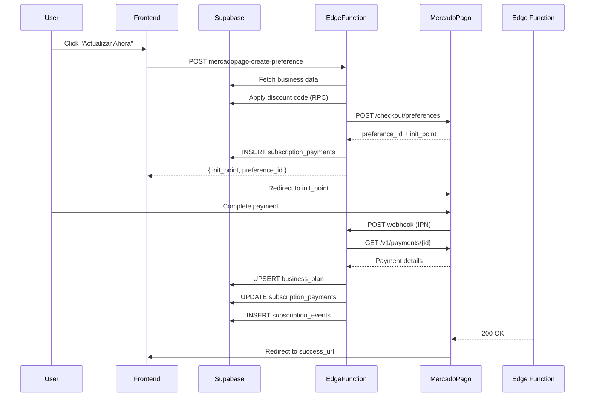

# Integración MercadoPago - Guía Completa

## 📋 Tabla de Contenidos
1. [Introducción](#introducción)
2. [Configuración](#configuración)
3. [Arquitectura](#arquitectura)
4. [Edge Functions](#edge-functions)
5. [Testing](#testing)
6. [Deployment](#deployment)
7. [Comparación vs Stripe/PayU](#comparación)
8. [Troubleshooting](#troubleshooting)

---

## 1. Introducción

MercadoPago es la pasarela de pagos de Mercado Libre, líder en América Latina con fuerte presencia en:
- 🇦🇷 Argentina (país de origen)
- 🇧🇷 Brasil
- 🇲🇽 México
- 🇨🇴 Colombia
- 🇨🇱 Chile
- 🇺🇾 Uruguay

### ✅ Ventajas de MercadoPago

| Característica | Descripción |
|---|---|
| **Cobertura LATAM** | Presente en 18 países de Latinoamérica |
| **Medios de Pago** | Tarjetas, efectivo (Oxxo, Baloto), transferencias |
| **Comisiones** | 4.99% + $0.49 USD en Argentina (varía por país) |
| **Checkout Pro** | Página de pago hosted sin PCI compliance |
| **IPN Notifications** | Webhooks automáticos para actualizar estados |

---

## 2. Configuración

### 2.1 Obtener Credenciales

1. **Crear cuenta MercadoPago** en https://www.mercadopago.com/
2. **Ir a Desarrolladores** → https://www.mercadopago.com/developers/panel/app
3. **Crear Aplicación:**
   - Nombre: "Gestabiz"
   - Selecciona "Pagos online" como producto
4. **Copiar credenciales:**
   - **Public Key** (sandbox): `TEST-xxxxxxxx-xxxx-xxxx-xxxx-xxxxxxxxxxxx`
   - **Access Token** (sandbox): `TEST-xxxxxxxxxxxx-xxxxxx-xxxxxxxxxxxxxxxxxxx-xxxxxxxx`
   - **Public Key** (producción): `APP_USR-xxxxxxxx-xxxx-xxxx-xxxx-xxxxxxxxxxxx`
   - **Access Token** (producción): `APP_USR-xxxxxxxxxxxx-xxxxxx-xxxxxxxxxxxxxxxxxxx-xxxxxxxx`

### 2.2 Variables de Entorno

#### Frontend (.env)
```bash
# Pasarela activa
VITE_PAYMENT_GATEWAY=mercadopago

# Public Key de MercadoPago
# SANDBOX (testing)
VITE_MERCADOPAGO_PUBLIC_KEY=TEST-xxxxxxxx-xxxx-xxxx-xxxx-xxxxxxxxxxxx

# PRODUCCIÓN
# VITE_MERCADOPAGO_PUBLIC_KEY=APP_USR-xxxxxxxx-xxxx-xxxx-xxxx-xxxxxxxxxxxx
```

#### Supabase Edge Functions (Secrets)
```bash
# Configurar secrets via CLI
npx supabase secrets set MERCADOPAGO_ACCESS_TOKEN=TEST-xxxxxxxxxxxx-xxxxxx-xxxxxxxxxxxxxxxxxxx-xxxxxxxx

# O via Dashboard
# Settings → Edge Functions → Secrets
# Variable: MERCADOPAGO_ACCESS_TOKEN
# Value: TEST-xxxxxxxxxxxx-xxxxxx-xxxxxxxxxxxxxxxxxxx-xxxxxxxx (sandbox)
```

### 2.3 Configurar IPN (Webhook)

1. **Ir a MercadoPago Developers** → Tu aplicación → Notificaciones IPN
2. **URL de notificación:**
   ```
   https://YOUR_PROJECT.supabase.co/functions/v1/mercadopago-webhook
   ```
3. **Eventos a recibir:**
   - ✅ Pagos (payments)
   - ✅ Merchant Orders (opcional)
4. **Guardar configuración**

---

## 3. Arquitectura

### 3.1 Flujo Completo



### 3.2 Componentes

#### **MercadoPagoGateway.ts** (225 líneas)
- Implementa `IPaymentGateway`
- Métodos: `createCheckoutSession`, `updateSubscription`, `cancelSubscription`, etc.
- Llama Edge Functions para operaciones

#### **PaymentGatewayFactory.ts** (actualizado)
- Factory pattern con 3 gateways: `stripe | payu | mercadopago`
- Variable `VITE_PAYMENT_GATEWAY` para switch

#### **Edge Functions**
1. **mercadopago-create-preference**: Crea Preference, retorna `init_point`
2. **mercadopago-webhook**: Procesa notificaciones IPN
3. **mercadopago-manage-subscription**: Update/cancel/pause/resume

---

## 4. Edge Functions

### 4.1 mercadopago-create-preference

**Ubicación:** `supabase/functions/mercadopago-create-preference/index.ts`

**Funcionalidad:**
1. Recibe `businessId`, `planType`, `billingCycle`, `discountCode`
2. Consulta business en Supabase
3. Calcula precio y aplica descuento (RPC `apply_discount_code`)
4. Crea Preference en MercadoPago con:
   ```json
   {
     "items": [{
       "title": "Plan Inicio - Mensual",
       "quantity": 1,
       "unit_price": 80000,
       "currency_id": "COP"
     }],
     "payer": {
       "name": "Negocio X",
       "email": "negocio@example.com"
     },
     "back_urls": {
       "success": "https://app.com/admin/billing?payment=success",
       "failure": "https://app.com/admin/billing?payment=failure",
       "pending": "https://app.com/admin/billing?payment=pending"
     },
     "notification_url": "https://project.supabase.co/functions/v1/mercadopago-webhook",
     "external_reference": "MP-12345678-1729180000000",
     "metadata": {
       "business_id": "uuid",
       "plan_type": "inicio",
       "billing_cycle": "monthly"
     }
   }
   ```
5. Guarda payment pendiente en `subscription_payments`
6. Retorna `{ preference_id, init_point }`

**Ejemplo de Response:**
```json
{
  "preference_id": "123456789-abcd-ef01-2345-67890abcdef0",
  "init_point": "https://www.mercadopago.com.co/checkout/v1/redirect?pref_id=123456789-abcd-ef01-2345-67890abcdef0",
  "sandbox_init_point": "https://sandbox.mercadopago.com.co/checkout/v1/redirect?pref_id=123456789-abcd-ef01-2345-67890abcdef0"
}
```

### 4.2 mercadopago-webhook

**Ubicación:** `supabase/functions/mercadopago-webhook/index.ts`

**Funcionalidad:**
1. Recibe notificación IPN de MercadoPago:
   - Query params: `?topic=payment&id=123456789`
2. Valida `topic` (solo procesa `payment`)
3. Consulta Payment API para obtener detalles:
   ```bash
   GET https://api.mercadopago.com/v1/payments/{id}
   Headers: Authorization: Bearer ACCESS_TOKEN
   ```
4. Extrae metadata (`business_id`, `plan_type`, `billing_cycle`)
5. Mapea status:
   - `approved` → `active`
   - `pending` → `trialing`
   - `rejected` → `past_due`
   - `refunded`/`cancelled` → `canceled`
6. Upsert `business_plan` con límites del plan
7. Update `subscription_payments`
8. Insert `subscription_events`
9. Retorna 200 OK

**Ejemplo de Notificación IPN:**
```
POST https://project.supabase.co/functions/v1/mercadopago-webhook?topic=payment&id=123456789
```

**Ejemplo de Payment Response:**
```json
{
  "id": 123456789,
  "status": "approved",
  "status_detail": "accredited",
  "transaction_amount": 80000,
  "currency_id": "COP",
  "payment_type_id": "credit_card",
  "payment_method_id": "master",
  "external_reference": "MP-12345678-1729180000000",
  "metadata": {
    "business_id": "uuid",
    "plan_type": "inicio",
    "billing_cycle": "monthly"
  }
}
```

---

## 5. Testing

### 5.1 Tarjetas de Prueba

MercadoPago proporciona tarjetas de prueba específicas por país:

#### 🇨🇴 Colombia (COP)
| Tarjeta | Número | CVV | Vencimiento | Resultado |
|---|---|---|---|---|
| Mastercard | `5474 9254 3267 0366` | 123 | 11/25 | ✅ Aprobado |
| Visa | `4013 5406 8274 6260` | 123 | 11/25 | ✅ Aprobado |
| Visa | `4168 8188 4444 7115` | 123 | 11/25 | ❌ Rechazado (fondos insuficientes) |
| Amex | `3711 803032 57522` | 1234 | 11/25 | ✅ Aprobado |

#### 🇦🇷 Argentina (ARS)
| Tarjeta | Número | CVV | Vencimiento | Resultado |
|---|---|---|---|---|
| Visa | `4509 9535 6623 3704` | 123 | 11/25 | ✅ Aprobado |
| Mastercard | `5031 7557 3453 0604` | 123 | 11/25 | ✅ Aprobado |

#### 🇲🇽 México (MXN)
| Tarjeta | Número | CVV | Vencimiento | Resultado |
|---|---|---|---|---|
| Visa | `4075 5957 1648 3764` | 123 | 11/25 | ✅ Aprobado |
| Mastercard | `5474 9254 3267 0366` | 123 | 11/25 | ✅ Aprobado |

#### 🇧🇷 Brasil (BRL)
| Tarjeta | Número | CVV | Vencimiento | Resultado |
|---|---|---|---|---|
| Visa | `4235 6477 2802 5682` | 123 | 11/25 | ✅ Aprobado |
| Mastercard | `5031 4332 1540 6351` | 123 | 11/25 | ✅ Aprobado |

### 5.2 Flujo de Testing

1. **Configurar Sandbox:**
   ```bash
   VITE_PAYMENT_GATEWAY=mercadopago
   VITE_MERCADOPAGO_PUBLIC_KEY=TEST-xxxxxxxx-xxxx-xxxx-xxxx-xxxxxxxxxxxx
   ```

2. **Iniciar app:**
   ```bash
   npm run dev
   ```

3. **Navegar a Facturación:**
   - Admin Dashboard → Facturación → Ver Plan Inicio

4. **Seleccionar Plan Inicio:**
   - Click "Actualizar Ahora" → Redirige a MercadoPago Checkout

5. **Completar pago en Sandbox:**
   - Usar tarjeta de prueba de Colombia (5474 9254 3267 0366)
   - CVV: 123
   - Vencimiento: 11/25
   - Nombre: TEST USER

6. **Verificar en Supabase:**
   ```sql
   -- Ver payment
   SELECT * FROM subscription_payments 
   WHERE business_id = 'your-business-id' 
   ORDER BY created_at DESC LIMIT 1;

   -- Ver suscripción
   SELECT * FROM business_plan WHERE business_id = 'your-business-id';

   -- Ver eventos
   SELECT * FROM subscription_events 
   WHERE business_id = 'your-business-id' 
   ORDER BY created_at DESC LIMIT 5;
   ```

7. **Verificar en Dashboard:**
   - Admin Dashboard → Facturación
   - Debe mostrar "Plan Inicio - Activo"

---

## 6. Deployment

### 6.1 Deploy Edge Functions

```bash
# Deploy create-preference
npx supabase functions deploy mercadopago-create-preference

# Deploy webhook
npx supabase functions deploy mercadopago-webhook

# Deploy manage-subscription
npx supabase functions deploy mercadopago-manage-subscription

# Verificar
npx supabase functions list
```

**Output esperado:**
```
┌──────────────────────────────────────┬─────────┬─────────────┐
│ NAME                                 │ STATUS  │ VERSION     │
├──────────────────────────────────────┼─────────┼─────────────┤
│ mercadopago-create-preference        │ ACTIVE  │ v1          │
│ mercadopago-webhook                  │ ACTIVE  │ v1          │
│ mercadopago-manage-subscription      │ ACTIVE  │ v1          │
└──────────────────────────────────────┴─────────┴─────────────┘
```

### 6.2 Configurar Secrets

```bash
# Access Token de producción
npx supabase secrets set MERCADOPAGO_ACCESS_TOKEN=APP_USR-xxxxxxxxxxxx-xxxxxx-xxxxxxxxxxxxxxxxxxx-xxxxxxxx

# Verificar
npx supabase secrets list
```

### 6.3 Producción

1. **Cambiar a credenciales de producción:**
   ```bash
   # .env
   VITE_MERCADOPAGO_PUBLIC_KEY=APP_USR-xxxxxxxx-xxxx-xxxx-xxxx-xxxxxxxxxxxx
   ```

2. **Actualizar Webhook URL en MercadoPago:**
   - Dashboard → Tu App → Notificaciones
   - URL: `https://YOUR_PROJECT.supabase.co/functions/v1/mercadopago-webhook`

3. **Deploy:**
   ```bash
   npm run build
   vercel --prod
   ```

---

## 7. Comparación

### 7.1 Stripe vs PayU vs MercadoPago

| Característica | Stripe | PayU Latam | MercadoPago |
|---|---|---|---|
| **Cobertura** | 🌍 Global (46 países) | 🌎 LATAM (18 países) | 🌎 LATAM (18 países) |
| **Comisión (COP)** | 2.9% + $0.30 USD | 3.49% + $900 COP | 4.99% + $0.49 USD |
| **Pagos en Efectivo** | ❌ No | ✅ Sí (Efecty, Baloto) | ✅ Sí (Oxxo, Baloto) |
| **Checkout Hosted** | ✅ Sí | ✅ Sí (WebCheckout) | ✅ Sí (Checkout Pro) |
| **Webhooks** | ✅ Sí | ✅ Sí | ✅ Sí (IPN) |
| **Suscripciones** | ✅ Nativo | ⚠️ Manual | ⚠️ Manual |
| **Testing** | ✅ Excelente | ✅ Bueno | ✅ Bueno |
| **Documentación** | ⭐⭐⭐⭐⭐ | ⭐⭐⭐⭐ | ⭐⭐⭐⭐ |
| **Integración** | ⚡ Rápida | ⚡ Rápida | ⚡ Rápida |

### 7.2 Recomendaciones por País

| País | Gateway Recomendado | Razón |
|---|---|---|
| 🇦🇷 Argentina | **MercadoPago** | Liderazgo local, confianza del mercado |
| 🇧🇷 Brasil | **MercadoPago** | Dominancia en e-commerce brasileño |
| 🇲🇽 México | **MercadoPago** | Fuerte presencia, pagos en efectivo (Oxxo) |
| 🇨🇴 Colombia | **PayU** o MercadoPago | PayU tiene menores comisiones |
| 🇨🇱 Chile | **MercadoPago** | Buena integración con mercado local |
| 🇺🇸 USA | **Stripe** | Mejor integración global |

---

## 8. Troubleshooting

### 8.1 Problemas Comunes

#### Error: "MERCADOPAGO_ACCESS_TOKEN not configured"
**Solución:**
```bash
npx supabase secrets set MERCADOPAGO_ACCESS_TOKEN=TEST-your-token
```

#### Error: "Preference creation failed"
**Causas:**
1. Access Token inválido
2. Moneda no soportada (debe ser COP, ARS, MXN, BRL, etc.)
3. Monto menor que el mínimo permitido

**Verificar:**
```bash
curl -X POST https://api.mercadopago.com/checkout/preferences \
  -H 'Authorization: Bearer TEST-your-token' \
  -H 'Content-Type: application/json' \
  -d '{
    "items": [{
      "title": "Test",
      "quantity": 1,
      "unit_price": 10000,
      "currency_id": "COP"
    }]
  }'
```

#### Webhook no se ejecuta
**Verificar:**
1. URL configurada en MercadoPago Dashboard
2. Edge Function desplegada:
   ```bash
   npx supabase functions list
   ```
3. Logs de Edge Function:
   ```bash
   npx supabase functions logs mercadopago-webhook
   ```

#### Payment queda en "pending"
**Causas:**
1. Tarjeta rechazada
2. Fondos insuficientes
3. Error en validación de tarjeta

**Solución:**
- Usar tarjetas de prueba correctas (ver sección 5.1)
- Verificar `status_detail` en el payment

### 8.2 Debug con Logs

```bash
# Ver logs de create-preference
npx supabase functions logs mercadopago-create-preference --tail

# Ver logs de webhook
npx supabase functions logs mercadopago-webhook --tail

# Ver últimos 50 logs
npx supabase functions logs mercadopago-webhook --limit 50
```

### 8.3 Verificar Preference en MercadoPago

```bash
curl -X GET https://api.mercadopago.com/checkout/preferences/PREFERENCE_ID \
  -H 'Authorization: Bearer TEST-your-token'
```

---

## 9. Referencias

- **Documentación Oficial:** https://www.mercadopago.com.ar/developers
- **API Reference:** https://www.mercadopago.com.ar/developers/es/reference
- **Tarjetas de Prueba:** https://www.mercadopago.com.ar/developers/es/docs/checkout-pro/additional-content/test-cards
- **IPN Notifications:** https://www.mercadopago.com.ar/developers/es/docs/subscriptions/integration-configuration/ipn
- **Dashboard:** https://www.mercadopago.com/developers/panel/app

---

**Documentado por:** GitHub Copilot  
**Fecha:** 17 de octubre de 2025  
**Versión:** 1.0.0  
**Archivos:** MercadoPagoGateway.ts (225 líneas), 3 Edge Functions (580 líneas total)
