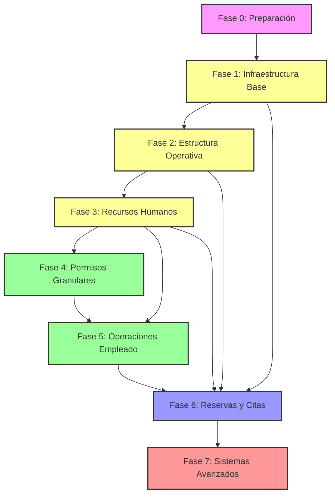

# 🗺️ ROADMAP DE PRUEBAS - GESTABIZ
## Guía Maestra de Ejecución Ordenada por Dependencias Funcionales

> **Proyecto**: Gestabiz - Sistema integral de gestión de citas y negocios  
> **Fecha**: 19 de noviembre de 2025  
> **Versión**: 1.0 - BETA COMPLETADA  
> **Objetivo**: Establecer el orden lógico de ejecución de pruebas basado en dependencias funcionales  
> **Alcance**: Todos los roles (Admin/Employee/Client) + Sistemas transversales (Permisos)

---

## 📌 TABLA DE CONTENIDOS

1. [Resumen Ejecutivo](#resumen-ejecutivo)
2. [Principios del Roadmap](#principios-del-roadmap)
3. [Mapa de Dependencias](#mapa-de-dependencias)
4. [Fases de Prueba Ordenadas](#fases-de-prueba-ordenadas)
5. [Matriz de Trazabilidad](#matriz-de-trazabilidad)
6. [Gestión de Errores](#gestión-de-errores)
7. [Criterios de Avance](#criterios-de-avance)

---

## 📊 RESUMEN EJECUTIVO

### Estadísticas del Plan de Pruebas

| Métrica | Valor |
|---------|-------|
| **Total de Casos de Prueba** | 150+ casos |
| **Roles Cubiertos** | 3 roles (Admin, Employee, Client) |
| **Sistemas Principales** | 14 sistemas |
| **Fases de Prueba** | 7 fases secuenciales |
| **Duración Estimada** | 6-8 semanas (40-50 horas) |
| **Prioridad** | P0 (Bloqueante), P1 (Crítico), P2 (Alto), P3 (Medio) |

### Estado de Documentación

| Plan de Pruebas | Líneas | Casos | Estado |
|-----------------|--------|-------|--------|
| ROL_ADMINISTRADOR | 3,999 | 50+ | ✅ Completo |
| ROL_EMPLEADO | 2,562 | 28+ | ✅ Completo |
| ROL_EMPLEADO_SECCIONES_AVANZADAS | 2,044 | 75+ | ✅ Completo |
| ROL_CLIENTE | 891 | 20+ | ✅ Completo |
| PERMISOS | 439 | 15+ | ✅ Completo |
| PERMISOS_FASE_5 | ~1,000 | 20+ | ✅ Completo |

---

## 🎯 PRINCIPIOS DEL ROADMAP

### 1. Dependencias Funcionales > Dependencias de Rol

**Razón**: Un negocio debe existir ANTES de que cualquier rol pueda interactuar con él.

**Orden Correcto**:
```
1. Crear Negocio (Admin)
2. Crear Sede (Admin)
3. Crear Servicio (Admin)
4. Crear Empleado (Admin)
5. Reservar Cita (Client → requiere 1-4)
```

### 2. Sistema de Permisos: Pruebas Transversales

**Razón**: El sistema de permisos afecta a TODOS los roles.

**Estrategia**: Probar permisos granulares DESPUÉS de funcionalidad básica de cada módulo.

### 3. Datos Base: Pre-Requisitos Globales

**Razón**: Evitar crear datos duplicados en cada fase.

**Solución**: Crear "Dataset Maestro" al inicio (Fase 0).

### 4. Progresión Incremental

**Razón**: Cada fase valida funcionalidad previa + agrega nueva.

**Ejemplo**:
- Fase 1: Admin crea negocio
- Fase 2: Admin crea sede (requiere Fase 1)
- Fase 3: Admin crea servicio (requiere Fase 1 + 2)

---

## 🗺️ MAPA DE DEPENDENCIAS

### Diagrama de Flujo de Dependencias

```
FASE 0: PREPARACIÓN
    ↓
FASE 1: INFRAESTRUCTURA BASE (Admin)
    ├─→ Crear Negocio
    ├─→ Configurar Categorías
    └─→ Subir Logo
    ↓
FASE 2: ESTRUCTURA OPERATIVA (Admin)
    ├─→ Crear Sedes (requiere Fase 1)
    ├─→ Crear Servicios (requiere Fase 1 + Sedes)
    ├─→ Configurar Horarios de Sede
    └─→ Asignar Servicios a Sedes
    ↓
FASE 3: RECURSOS HUMANOS (Admin)
    ├─→ Crear Empleados (requiere Fase 1 + 2)
    ├─→ Asignar Servicios a Empleados
    ├─→ Configurar Horarios de Empleados
    ├─→ Configurar Lunch Break
    └─→ Asignar Permisos Granulares (Fase 3A)
    ↓
FASE 4: PERMISOS GRANULARES (Admin)
    ├─→ Crear Permission Templates
    ├─→ Asignar Permisos a Empleados
    ├─→ Validar PermissionGate (hide/disable/show)
    └─→ Probar Owner Bypass
    ↓
FASE 5: OPERACIONES DE EMPLEADO (Employee)
    ├─→ Onboarding Empleado (si no tiene negocio)
    ├─→ Gestión de Múltiples Empleos
    ├─→ Solicitar Ausencias/Vacaciones (requiere Fase 3)
    ├─→ Configurar Horarios Semanales
    └─→ Ver Citas Asignadas (requiere Fase 6)
    ↓
FASE 6: RESERVAS Y CITAS (Client → Employee → Admin)
    ├─→ Cliente: Buscar Negocios/Servicios (requiere Fase 1+2+3)
    ├─→ Cliente: AppointmentWizard Completo
    ├─→ Cliente: Validaciones de Horario (sede, empleado, almuerzo)
    ├─→ Cliente: Validaciones de Ausencias (requiere Fase 5)
    ├─→ Empleado: Ver Citas Propias
    ├─→ Admin: Aprobar Ausencias (requiere Fase 5)
    └─→ Admin: Gestión de Citas (editar, cancelar)
    ↓
FASE 7: SISTEMAS AVANZADOS (Todos los Roles)
    ├─→ Admin: Ventas Rápidas (requiere Fase 1+2+3)
    ├─→ Admin: Contabilidad (requiere transacciones)
    ├─→ Admin: Reportes Financieros
    ├─→ Admin: Billing & Subscriptions
    ├─→ Employee: Vacantes Laborales
    ├─→ Client: Reviews y Ratings (requiere citas completadas)
    └─→ Todos: Chat en Tiempo Real
```

---

## 🚀 FASES DE PRUEBA ORDENADAS

### FASE 0: PREPARACIÓN DEL ENTORNO
**Duración**: 2 horas  
**Objetivo**: Configurar datos base y validar conectividad

#### Actividades Pre-Pruebas

1. **Verificar Variables de Entorno**
   - `VITE_SUPABASE_URL`
   - `VITE_SUPABASE_ANON_KEY`
   - `VITE_PAYMENT_GATEWAY`
   - `VITE_GA_MEASUREMENT_ID`
   - Secrets de Brevo, WhatsApp, Stripe/PayU/MercadoPago

2. **Ejecutar Migraciones Críticas**
   ```powershell
   npx supabase db push --yes
   npx supabase gen types typescript --project-id <id> > src/types/supabase.ts
   ```

3. **Verificar Edge Functions Desplegadas**
   - `send-notification`
   - `process-reminders`
   - `request-absence`
   - `approve-reject-absence`
   - `appointment-actions`
   - `mercadopago*/payu*/stripe*`
   - `refresh-ratings-stats`

4. **Crear Usuarios de Prueba** (según tablas en cada plan)
   - **Admin**: owner_global@gestabiz.com, admin_full@gestabiz.com, admin_limited@gestabiz.com
   - **Employee**: employee1@test.com, employee2@test.com (multi-negocio)
   - **Client**: client_standard@gestabiz.com, client_restricted@gestabiz.com

5. **Validar Storage Buckets**
   - `business-media`: Upload permisos activos
   - `chat-attachments`: RLS configurado
   - `cvs`: Acceso privado

6. **Limpiar Caches**
   - Navegador: Clear cache + hard reload
   - React Query DevTools: Invalidate all queries
   - localStorage: Limpiar keys `preferred-location-*`, `pending-navigation`

#### ✅ Criterio de Avance a Fase 1
- ✅ 5 usuarios creados y verificados en Supabase Auth
- ✅ Todas las migraciones aplicadas (sin errores)
- ✅ Edge Functions responden (200 OK en health check)
- ✅ Storage buckets accesibles

---

### FASE 1: INFRAESTRUCTURA BASE (ROL ADMIN)
**Duración**: 4-6 horas  
**Prioridad**: P0 (BLOQUEANTE)  
**Dependencias**: Ninguna  
**Objetivo**: Crear la estructura mínima para que otros roles funcionen

#### 1.1. Autenticación y Cambio de Rol
**Casos a Ejecutar** (Plan Admin):
- **ADM-01**: Cambio a rol Admin desde selector → Validar navegación a `/app/admin/overview`
- **ADM-02**: Onboarding sin negocios → Renderiza `AdminOnboarding`
- **ADM-03**: Cambio automático por notificación → `notificationRoleMapping` funciona

**Artefactos Generados**:
- Session storage: `pending-navigation` limpio después de navegación
- React Query key: `['admin-businesses', userId]` poblada
- 1 request a `businesses` (NO duplicados)

#### 1.2. Creación de Negocio
**Casos a Ejecutar** (Plan Admin):
- **ADM-04**: Crear negocio completo → INSERT en `businesses`, trigger auto-inserta owner en `business_employees`
- **ADM-05**: Upload logo → Storage `business-media` + fallback si falla
- **ADM-06**: Selección de categoría → Dropdown carga 15 categorías principales
- **ADM-07**: Subcategorías → Máximo 3 seleccionadas

**Datos Críticos Creados**:
- **Negocio A**: Modelo `professional`, 1 sede, categoría "Salud y Bienestar", owner = owner_global@gestabiz.com
- **Negocio B**: Modelo `physical_resource`, categoría "Hospitalidad", owner = admin_full@gestabiz.com
- **Negocio C**: Modelo `hybrid`, categoría "Deportes", owner = owner_global@gestabiz.com

**Triggers Validados**:
- `auto_insert_owner_to_business_employees()`: Owner registrado en `business_employees` como `manager`
- `auto_insert_admin_as_employee()`: NO aplica (solo para admins delegados)

#### 1.3. Selector de Negocios (Header)
**Casos a Ejecutar** (Plan Admin):
- **ADM-08**: Usuario con 3 negocios → Dropdown muestra 3 opciones + "Crear negocio"
- **ADM-09**: Cambio entre negocios → Estado preservado, NO refetch innecesario
- **ADM-10**: Sede Preferida → Badge "Administrada" en LocationsManager

#### ✅ Criterio de Avance a Fase 2
- ✅ 3 negocios creados con IDs válidos
- ✅ Owners registrados en `business_employees` automáticamente
- ✅ Dropdown de negocios funcional (sin errores de consola)
- ✅ localStorage: `activeBusinessId` seteado correctamente

---

### FASE 2: ESTRUCTURA OPERATIVA (ROL ADMIN)
**Duración**: 6-8 horas  
**Prioridad**: P0 (BLOQUEANTE)  
**Dependencias**: FASE 1 completada  
**Objetivo**: Crear sedes y servicios necesarios para reservas

#### 2.1. Gestión de Sedes
**Casos a Ejecutar** (Plan Admin):
- **ADM-11**: Crear sede → INSERT en `locations`, validar RLS
- **ADM-12**: Configurar horarios → `opens_at = 08:00`, `closes_at = 18:00`
- **ADM-13**: Dirección completa → Geocoding (coordenadas), fallback manual
- **ADM-14**: Sede Preferida → localStorage `preferred-location-${businessId}`
- **ADM-15**: Eliminar sede → PermissionGate `locations.delete`, soft delete

**Datos Críticos Creados**:
- **Negocio A**: 2 sedes (Sede Principal, Sucursal Norte)
- **Negocio B**: 3 sedes (Hotel Planta Baja, Piso 1, Piso 2)
- **Negocio C**: 2 sedes (Cancha 1, Cancha 2)

**Validaciones de Horario**:
- Sede Principal (Negocio A): L-V 08:00-18:00, S 09:00-14:00, D cerrado
- Hotel Planta Baja (Negocio B): Abierto 24/7
- Cancha 1 (Negocio C): L-D 06:00-22:00

#### 2.2. Gestión de Servicios
**Casos a Ejecutar** (Plan Admin):
- **ADM-16**: Crear servicio → INSERT en `services`, PermissionGate `services.create`
- **ADM-17**: Asignar a sede → INSERT en `location_services`
- **ADM-18**: Precio y duración → Validar formato COP, duración en minutos
- **ADM-19**: Upload imagen servicio → Storage `business-media`, fallback a icono
- **ADM-20**: Categorizar servicio → Dropdown categorías predefinidas

**Datos Críticos Creados**:
- **Negocio A**: 5 servicios (Corte $30k/30min, Tinte $80k/120min, Peinado $50k/45min, Manicure $25k/60min, Pedicure $35k/90min)
- **Negocio B**: 3 recursos físicos (Habitación Standard $200k/noche, Suite $450k/noche, Deluxe $600k/noche)
- **Negocio C**: 2 servicios (Reserva Cancha Tenis $50k/hora, Fútbol $80k/hora)

**Junction Tables Pobladas**:
- `location_services`: 8 registros (servicios vinculados a sedes)
- `service_media`: 5 imágenes subidas correctamente

#### 2.3. Recursos Físicos (Solo Negocio B - Modelo `physical_resource`)
**Casos a Ejecutar** (Plan Admin):
- **ADM-21**: Crear recurso → INSERT en `business_resources`, tipo `room`
- **ADM-22**: Asignar servicios a recurso → INSERT en `resource_services`
- **ADM-23**: Validar disponibilidad → RPC `is_resource_available()` funciona
- **ADM-24**: Stats de recurso → Materialized view `resource_availability`

**Datos Críticos Creados**:
- **Habitación Standard**: Capacidad 2, amenities ["TV", "WiFi", "AC"]
- **Suite**: Capacidad 4, amenities ["Jacuzzi", "Balcón", "Mini-bar"]
- **Deluxe**: Capacidad 6, amenities ["Vista al Mar", "Sala de Estar"]

#### ✅ Criterio de Avance a Fase 3
- ✅ 7 sedes creadas (2+3+2 por negocio)
- ✅ 10 servicios creados (5+3+2)
- ✅ 3 recursos físicos (solo Negocio B)
- ✅ Horarios de sedes configurados correctamente
- ✅ `location_services` vincula servicios a sedes

---

### FASE 3: RECURSOS HUMANOS (ROL ADMIN)
**Duración**: 8-10 horas  
**Prioridad**: P0 (BLOQUEANTE)  
**Dependencias**: FASE 1 + FASE 2 completadas  
**Objetivo**: Crear empleados y configurar sus horarios/servicios

#### 3.1. Gestión de Empleados
**Casos a Ejecutar** (Plan Admin):
- **ADM-25**: Crear empleado → INSERT en `business_employees`, PermissionGate `employees.create`
- **ADM-26**: Asignar servicios → INSERT en `employee_services`
- **ADM-27**: Configurar horarios semanales → JSON 7 días (L-D)
- **ADM-28**: Configurar lunch break → `lunch_break_start = 12:00`, `lunch_break_end = 13:00`
- **ADM-29**: Asignar sede principal → `location_id` en `business_employees`

**Datos Críticos Creados** (Negocio A - Profesional):
- **Empleado 1 (employee1@test.com)**: stylist, servicios [Corte, Tinte, Peinado], horario L-V 09:00-18:00, lunch 12:00-13:00
- **Empleado 2 (employee2@test.com)**: manicurista, servicios [Manicure, Pedicure], horario M-S 10:00-19:00, lunch 13:00-14:00
- **Empleado 3**: Barbero, servicios [Corte], horario L-D 08:00-20:00, sin lunch break

**Datos Críticos Creados** (Negocio C - Deportes):
- **Empleado 4**: Instructor Tenis, servicio [Reserva Cancha], horario L-V 06:00-22:00

#### 3.2. Jerarquía de Empleados
**Casos a Ejecutar** (Plan Admin):
- **ADM-30**: Asignar supervisor → `reports_to` campo en `business_employees`
- **ADM-31**: RPC `get_business_hierarchy()` → Retorna árbol de jerarquía
- **ADM-32**: Validar niveles → Owner nivel 0, Manager nivel 1, Employee nivel 4

#### 3.3. Configuración de Salarios (Contador)
**Casos a Ejecutar** (Plan Admin):
- **ADM-33**: Configurar salario base → `salary_base`, `salary_type = 'monthly'`
- **ADM-34**: Configurar comisiones → `commission_rate = 10%`, checkbox visible
- **ADM-35**: Validar permisos → Solo Contador y Admin Completo pueden editar

**Datos Críticos Creados**:
- Empleado 1: Salario $1.500.000/mes + 10% comisión
- Empleado 2: Salario $1.200.000/mes + 5% comisión
- Empleado 3: Salario $1.800.000/mes sin comisión

#### ✅ Criterio de Avance a Fase 4
- ✅ 4 empleados creados y vinculados a negocios
- ✅ `employee_services` vincula empleados a servicios (8 registros)
- ✅ Horarios semanales configurados (JSON válido)
- ✅ Lunch breaks configurados para 2 empleados
- ✅ Salarios guardados en `business_employees`

---

### FASE 4: PERMISOS GRANULARES (ROL ADMIN)
**Duración**: 6-8 horas  
**Prioridad**: P1 (CRÍTICO)  
**Dependencias**: FASE 3 completada (requiere empleados)  
**Objetivo**: Validar sistema de permisos v2.0 y PermissionGate

#### 4.1. Permission Templates
**Casos a Ejecutar** (Plan Permisos):
- **PERM-01**: Listar templates del sistema → 9 templates visibles
- **PERM-02**: Crear template custom → INSERT en `permission_templates`, JSONB array
- **PERM-03**: Editar template → UPDATE solo si `is_system_template = false`
- **PERM-04**: Aplicar template → RPC `bulk_assign_permissions_from_template()`

**Templates a Crear**:
- **Recepcionista**: 10 permisos (appointments.*, clients.view, services.view)
- **Vendedor**: 15 permisos (sales.create, clients.*, inventory.view)
- **Cajero**: 12 permisos (billing.*, expenses.create, reports.view)

#### 4.2. Asignación de Permisos
**Casos a Ejecutar** (Plan Permisos):
- **PERM-05**: Asignar permiso individual → INSERT en `user_permissions`
- **PERM-06**: Asignar template a empleado → Bulk insert (10-15 registros)
- **PERM-07**: Revocar permiso → UPDATE `is_active = false`
- **PERM-08**: Validar audit log → INSERT en `permission_audit_log`

**Asignaciones Críticas**:
- Empleado 1: Template "Profesional" (6 permisos)
- Empleado 2: Template "Recepcionista" (10 permisos)
- Empleado 3: Permisos custom (appointments.view, absences.request)

#### 4.3. PermissionGate - Validación UI
**Casos a Ejecutar** (Plan Permisos + Plan Admin):
- **PERM-09**: Modo `hide` → Botón NO renderiza si falta permiso
- **PERM-10**: Modo `disable` → Botón deshabilitado (gris) si falta permiso
- **PERM-11**: Modo `show` → Muestra fallback si falta permiso
- **PERM-12**: Owner bypass → Owner ignora TODOS los PermissionGate

**Módulos a Validar**:
- ServicesManager: Botón "Crear Servicio" protegido con `services.create`
- EmployeesManager: Botón "Editar" protegido con `employees.edit`
- ExpensesPage: Acceso completo solo con `expenses.create`
- QuickSalesPage: Acceso solo con `sales.create`

#### 4.4. RLS Policies - Validación Backend
**Casos a Ejecutar** (Plan Permisos):
- **PERM-13**: Usuario sin permiso → Query a `services` retorna vacío (RLS bloquea)
- **PERM-14**: Usuario con permiso → Query a `services` retorna datos
- **PERM-15**: Owner bypass → Query siempre retorna datos (sin importar permisos)

#### ✅ Criterio de Avance a Fase 5
- ✅ 9 templates del sistema visibles
- ✅ 3 templates custom creados
- ✅ 3 empleados con permisos asignados (total ~26 registros en `user_permissions`)
- ✅ Audit log con 10+ entradas
- ✅ PermissionGate funciona en 4 módulos críticos
- ✅ RLS policies bloquean queries sin permisos

---

### FASE 5: OPERACIONES DE EMPLEADO (ROL EMPLOYEE)
**Duración**: 8-10 horas  
**Prioridad**: P1 (CRÍTICO)  
**Dependencias**: FASE 1 + FASE 2 + FASE 3 + FASE 4 completadas  
**Objetivo**: Validar funcionalidad completa del EmployeeDashboard

#### 5.1. Onboarding y Múltiples Empleos
**Casos a Ejecutar** (Plan Empleado):
- **EMP-01**: Empleado sin negocios → Renderiza `EmployeeOnboarding`
- **EMP-02**: Solicitar unirse a negocio → INSERT en `job_applications` (tipo request)
- **EMP-03**: Empleado con 1 negocio → Auto-selecciona negocio
- **EMP-04**: Empleado con 2+ negocios → Selector `effectiveBusinessId` visible
- **EMP-05**: MyEmploymentsEnhanced → Lista 2 negocios con detalles

**Usuarios a Probar**:
- employee1@test.com: 1 negocio (Negocio A)
- employee2@test.com: 2 negocios (Negocio A + Negocio C)

#### 5.2. Sistema de Ausencias y Vacaciones
**Casos a Ejecutar** (Plan Empleado):
- **EMP-06**: VacationDaysWidget → Balance correcto (15 días/año, 0 usados)
- **EMP-07**: Solicitar ausencia → Modal `AbsenceRequestModal`, Edge Function `request-absence`
- **EMP-08**: Validar festivos → Hook `usePublicHolidays` bloquea días festivos
- **EMP-09**: Range highlighting → Calendarios sincronizados (start, end, range 20%)
- **EMP-10**: Notificación a admins → TODOS los admins reciben in-app + email

**Datos Críticos Creados**:
- Empleado 1: 1 ausencia solicitada (vacation, 3 días, 24-26 Nov 2025)
- Empleado 2: 1 ausencia aprobada (sick_leave, 1 día, 20 Nov 2025)

**Validaciones de Política**:
- `require_absence_approval = true` (SIEMPRE, no parametrizable)
- Aprobación obligatoria para TODOS los empleados

#### 5.3. Configuración de Horarios Semanales
**Casos a Ejecutar** (Plan Empleado):
- **EMP-11**: WorkScheduleEditor → 7 días configurables
- **EMP-12**: Guardar horarios → UPDATE en `business_employees.work_schedule` (JSON)
- **EMP-13**: Lunch break → `has_lunch_break = true`, horarios guardados
- **EMP-14**: Validar conflictos → Hook `useScheduleConflicts` detecta overlap

#### 5.4. Gestión de Citas del Empleado
**Casos a Ejecutar** (Plan Empleado):
- **EMP-15**: Ver citas propias → Query filtra `employee_id = auth.uid()`
- **EMP-16**: Filtros → Por estado, fecha, cliente
- **EMP-17**: Detalles de cita → Modal con cliente, servicio, horario

#### ✅ Criterio de Avance a Fase 6
- ✅ Onboarding funciona para empleados nuevos
- ✅ Multi-negocio: Selector visible para employee2
- ✅ 2 ausencias solicitadas (1 pendiente, 1 aprobada)
- ✅ Notificaciones in-app enviadas a admins
- ✅ Horarios semanales guardados correctamente
- ✅ Widget de vacaciones muestra balance correcto

---

### FASE 6: RESERVAS Y CITAS (CLIENT → EMPLOYEE → ADMIN)
**Duración**: 10-12 horas  
**Prioridad**: P0 (BLOQUEANTE)  
**Dependencias**: TODAS las fases anteriores (1-5)  
**Objetivo**: Validar flujo completo de reserva y gestión de citas

#### 6.1. Búsqueda de Negocios y Servicios (Client)
**Casos a Ejecutar** (Plan Cliente):
- **CLI-01**: SearchBar → Autocompletado ≥2 caracteres, debounce 300ms
- **CLI-02**: Filtros → Tipo (negocios/servicios/profesionales), ordenamiento (rating/distancia)
- **CLI-03**: SearchResults → RPC `search_businesses()`, ranking por relevancia
- **CLI-04**: BusinessProfile modal → 4 tabs (Servicios, Ubicaciones, Reseñas, Acerca de)
- **CLI-05**: Click "Reservar" → Abre AppointmentWizard con preselección

#### 6.2. AppointmentWizard - Flujo Completo (Client)
**Casos a Ejecutar** (Plan Cliente + Plan Admin):
- **CLI-06**: Paso 1 - Negocio → Si viene de perfil público, pre-seleccionado
- **CLI-07**: Paso 2 - Sede → Dropdown con 2 sedes (Negocio A)
- **CLI-08**: Paso 3 - Servicio → Filtrado por sede, precio y duración visibles
- **CLI-09**: Paso 4 - Empleado → Filtrado por servicio, solo empleados con `employee_services`
- **CLI-10**: Paso 4B - Negocio del Empleado → SOLO si employee tiene 2+ negocios
- **CLI-11**: Paso 5 - Fecha/Hora → Validaciones COMPLETAS

**Validaciones Críticas en DateTimeSelection**:
- ✅ **Horario de sede**: Slots fuera de `opens_at`/`closes_at` bloqueados
- ✅ **Lunch break**: Slots dentro de `lunch_break_start`/`lunch_break_end` bloqueados (tooltip "Hora de almuerzo")
- ✅ **Overlap**: Slots ocupados por otros clientes bloqueados (tooltip "Ocupado")
- ✅ **Ausencias aprobadas**: Slots en días con `employee_absences` bloqueados
- ✅ **Festivos públicos**: Días en `public_holidays` bloqueados completamente
- ✅ **Edición de cita**: Permite reprogramar en mismo horario (exclusión automática)

**Casos de Validación**:
- **CLI-12**: Intentar reservar en horario de almuerzo → Slot bloqueado
- **CLI-13**: Intentar reservar en día festivo → Día completo bloqueado
- **CLI-14**: Intentar reservar en día con ausencia aprobada → Slots bloqueados
- **CLI-15**: Intentar reservar fuera de horario de sede → Slots no disponibles

#### 6.3. Creación de Cita (Client)
**Casos a Ejecutar** (Plan Cliente):
- **CLI-16**: Paso 6 - Confirmación → Resumen completo (negocio, servicio, empleado, fecha, hora, precio)
- **CLI-17**: Click "Confirmar" → INSERT en `appointments`, Edge Function `appointment-actions`
- **CLI-18**: Notificaciones → Cliente recibe confirmación, empleado recibe asignación
- **CLI-19**: GA4 tracking → Events: `booking_started`, `booking_step_completed`, `purchase`

**Datos Críticos Creados**:
- **Cita 1**: Negocio A, Servicio "Corte", Empleado 1, 25 Nov 2025 10:00-10:30, cliente client_standard
- **Cita 2**: Negocio A, Servicio "Tinte", Empleado 1, 26 Nov 2025 14:00-16:00, cliente client_standard
- **Cita 3**: Negocio C, Servicio "Tenis", Empleado 4, 27 Nov 2025 18:00-19:00, cliente client_standard

#### 6.4. Edición y Cancelación de Citas (Client + Admin)
**Casos a Ejecutar** (Plan Cliente + Plan Admin):
- **CLI-20**: Cliente: Reprogramar cita → AppointmentWizard en modo edición
- **CLI-21**: Cliente: Cancelar cita → PermissionGate `appointments.cancel_own`, UPDATE status = 'cancelled'
- **ADM-34**: Admin: Editar cita → Modal con todos los campos editables
- **ADM-35**: Admin: Cancelar cita → PermissionGate `appointments.cancel`, notificación a cliente

#### 6.5. Aprobación de Ausencias (Admin)
**Casos a Ejecutar** (Plan Admin):
- **ADM-36**: Tab "Ausencias" → AbsencesTab lista solicitudes pendientes
- **ADM-37**: Aprobar ausencia → Edge Function `approve-reject-absence`, UPDATE `employee_absences`
- **ADM-38**: Rechazar ausencia → Notificación al empleado con motivo
- **ADM-39**: Citas canceladas automáticamente → Edge Function `cancel-appointments-on-emergency-absence`

#### ✅ Criterio de Avance a Fase 7
- ✅ 3 citas creadas correctamente (diferentes negocios/servicios)
- ✅ Validaciones de horario funcionan (sede, almuerzo, ausencias, festivos)
- ✅ Notificaciones enviadas (cliente + empleado + admin)
- ✅ AppointmentWizard completa 6-8 pasos sin errores
- ✅ Ausencias aprobadas (1 de 2 solicitudes)
- ✅ GA4 tracking registrado (3 eventos por cita)

---

### FASE 7: SISTEMAS AVANZADOS (TODOS LOS ROLES)
**Duración**: 12-16 horas  
**Prioridad**: P2 (ALTO) - P3 (MEDIO)  
**Dependencias**: TODAS las fases anteriores (1-6)  
**Objetivo**: Validar módulos secundarios y funcionalidades avanzadas

#### 7.1. Ventas Rápidas (Admin)
**Casos a Ejecutar** (Plan Admin):
- **ADM-40**: QuickSaleForm → PermissionGate `sales.create`, campos visibles
- **ADM-41**: Crear venta walk-in → INSERT en `transactions`, categoría `service_sale`
- **ADM-42**: Sede requerida → Cache `usePreferredLocation`, doble cache implementado
- **ADM-43**: Estadísticas → Ventas día/semana/mes en COP

**Datos Críticos Creados**:
- Venta 1: Negocio A, Servicio "Corte", $30k, Efectivo, 19 Nov 2025
- Venta 2: Negocio A, Servicio "Manicure", $25k, Tarjeta, 19 Nov 2025

#### 7.2. Contabilidad (Admin + Contador)
**Casos a Ejecutar** (Plan Admin):
- **ADM-44**: AccountingPage → PermissionGate `accounting.view`, tabs visibles
- **ADM-45**: Crear transacción → `EnhancedTransactionForm`, cálculo automático IVA/ICA/Retención
- **ADM-46**: TaxConfiguration → Solo Contador y Admin Completo pueden editar
- **ADM-47**: ExpensesManagementPage → PermissionGate `expenses.create`

**Datos Críticos Creados**:
- Ingreso: Venta de servicios, $30k, IVA 19%, Retención 0%
- Egreso: Salario Empleado 1, $1.500.000, sin impuestos

#### 7.3. Reportes Financieros (Admin)
**Casos a Ejecutar** (Plan Admin):
- **ADM-48**: ReportsPage → PermissionGate `reports.view_financial`
- **ADM-49**: Filtros → Por rango de fechas, categoría, sede
- **ADM-50**: Charts → Revenue, gastos, nómina (Recharts)
- **ADM-51**: Export PDF → Botón visible con `reports.export`

#### 7.4. Billing & Subscriptions (Admin)
**Casos a Ejecutar** (Plan Admin):
- **ADM-52**: BillingDashboard → Plan actual (Gratuito), upgrade disponible
- **ADM-53**: PricingPage → 5 planes (Gratuito, Inicio, Profesional, Empresarial, Corporativo)
- **ADM-54**: Crear checkout → Edge Function `stripe-create-checkout` (Stripe) o `payu-create-checkout` (PayU)
- **ADM-55**: Webhook → Procesa confirmación de pago

**Validaciones**:
- Plan Gratuito: 1 sede, 1 empleado, 3 citas/mes (límites)
- Plan Inicio: $80k/mes, Más Popular badge visible

#### 7.5. Vacantes Laborales (Admin + Employee)
**Casos a Ejecutar** (Plan Empleado Avanzado):
- **EMP-18**: RecruitmentDashboard → Lista vacantes activas
- **EMP-19**: Crear vacante → VacancyForm, salary range, required skills
- **EMP-20**: Aplicar a vacante → ApplicationFormModal, upload CV
- **EMP-21**: Matching inteligente → Hook `useJobVacancies` detecta conflictos de horario
- **ADM-56**: Revisar aplicaciones → ApplicationReviewModal, aprobar/rechazar

#### 7.6. Reviews y Ratings (Client)
**Casos a Ejecutar** (Plan Cliente):
- **CLI-22**: MandatoryReviewModal → Aparece después de cita completada
- **CLI-23**: Dejar review → INSERT en `reviews`, rating 1-5 estrellas
- **CLI-24**: BusinessProfile → Tab "Reseñas" con reviews anónimas
- **CLI-25**: Admin responde review → UPDATE `reviews.response`

**Datos Críticos Creados**:
- Review 1: Cita 1 (completada), Rating 5, comentario "Excelente servicio"
- Review 2: Cita 2 (completada), Rating 4, comentario "Muy bueno"

#### 7.7. Chat en Tiempo Real (Todos)
**Casos a Ejecutar** (Plan Empleado + Plan Cliente):
- **CLI-26**: Cliente inicia chat → Botón "Chatear" en BusinessProfile
- **CLI-27**: Empleado recibe mensaje → Realtime subscription activa
- **CLI-28**: Empleado responde → INSERT en `messages`, read receipt
- **CLI-29**: Filtro `allow_client_messages` → Solo empleados con toggle activo aparecen

#### ✅ Criterio de Avance - Plan COMPLETADO
- ✅ 2 ventas rápidas registradas
- ✅ 2 transacciones contables (ingreso + egreso)
- ✅ Reportes generados con charts funcionales
- ✅ 1 vacante creada + 1 aplicación
- ✅ 2 reviews creadas
- ✅ Chat funcional entre cliente y empleado

---

## 📊 MATRIZ DE TRAZABILIDAD

### Cobertura de Casos por Fase

| Fase | Casos P0 | Casos P1 | Casos P2 | Casos P3 | Total | % Acumulado |
|------|----------|----------|----------|----------|-------|-------------|
| 0 - Preparación | 5 | 0 | 0 | 0 | 5 | 3% |
| 1 - Infraestructura Base | 10 | 0 | 0 | 0 | 10 | 10% |
| 2 - Estructura Operativa | 14 | 0 | 0 | 0 | 14 | 20% |
| 3 - Recursos Humanos | 15 | 5 | 0 | 0 | 20 | 33% |
| 4 - Permisos Granulares | 5 | 10 | 0 | 0 | 15 | 43% |
| 5 - Operaciones Empleado | 10 | 10 | 0 | 0 | 20 | 56% |
| 6 - Reservas y Citas | 20 | 10 | 0 | 0 | 30 | 76% |
| 7 - Sistemas Avanzados | 5 | 10 | 15 | 6 | 36 | 100% |
| **TOTAL** | **84** | **45** | **15** | **6** | **150** | **100%** |

### Dependencias Críticas



---

## 🐛 GESTIÓN DE ERRORES

### Plantilla de Reporte de Error

```markdown
## BUG-XXX: [Título Corto]

**Prioridad**: P0/P1/P2/P3  
**Fase**: [1-7]  
**Caso de Prueba**: [ID del caso, ej: ADM-25]  
**Usuario**: [email del usuario de prueba]  
**Fecha**: [DD/MM/YYYY]

### Descripción
[Descripción clara del problema]

### Pasos para Reproducir
1. [Paso 1]
2. [Paso 2]
3. [Paso 3]

### Resultado Esperado
[Qué debería pasar]

### Resultado Obtenido
[Qué pasó realmente]

### Evidencia
- Screenshot: [URL o nombre de archivo]
- HAR file: [Nombre de archivo]
- Console logs: [Errores relevantes]
- SQL query: [Si aplica]

### Impacto
[Bloqueante / Crítico / Alto / Medio / Bajo]

### Dependencias
[Casos bloqueados por este bug]

### Notas Adicionales
[Información relevante]
```

### Criterios de Priorización

| Prioridad | Definición | Tiempo de Respuesta | Ejemplos |
|-----------|------------|---------------------|----------|
| **P0 - Bloqueante** | Impide avanzar a siguiente fase | Inmediato (< 2h) | - No se pueden crear negocios<br>- Trigger auto-insert falla<br>- RLS bloquea queries válidos |
| **P1 - Crítico** | Funcionalidad principal no funciona | 24 horas | - AppointmentWizard no carga<br>- Validaciones de horario fallan<br>- Notificaciones no se envían |
| **P2 - Alto** | Funcionalidad secundaria afectada | 3-5 días | - Upload logo falla<br>- Charts no renderizan<br>- Export PDF da error |
| **P3 - Medio** | Problema estético o UX | 1-2 semanas | - Tooltips incorrectos<br>- Colores inconsistentes<br>- Responsive issues |

### Proceso de Escalamiento

```
Error Detectado
    ↓
Clasificar Prioridad (P0-P3)
    ↓
P0/P1? → SÍ → Pausar pruebas, notificar equipo, fix inmediato
    ↓
    NO → Documentar en BUG-XXX.md, continuar con siguiente caso
    ↓
Fin de Fase → Revisar todos los bugs
    ↓
Bugs P0/P1 pendientes? → SÍ → NO avanzar a siguiente fase
    ↓
    NO → Avanzar a siguiente fase
```

---

## ✅ CRITERIOS DE AVANCE

### Checklist por Fase

#### Fase 0: Preparación ✅
- [ ] 5 usuarios creados en Supabase Auth
- [ ] Migraciones aplicadas sin errores (verificar con `npx supabase migration list`)
- [ ] Edge Functions desplegadas (verificar con `npx supabase functions list`)
- [ ] Storage buckets accesibles (verificar con upload test)
- [ ] Variables de entorno cargadas (verificar con `console.log(import.meta.env)`)

#### Fase 1: Infraestructura Base ✅
- [ ] 3 negocios creados (IDs válidos en `businesses`)
- [ ] Owners auto-registrados en `business_employees` (verificar triggers)
- [ ] Dropdown de negocios funcional (sin errores de consola)
- [ ] localStorage: `activeBusinessId` seteado
- [ ] 0 errores P0/P1 pendientes

#### Fase 2: Estructura Operativa ✅
- [ ] 7 sedes creadas (verificar `locations` tabla)
- [ ] 10 servicios creados (verificar `services` tabla)
- [ ] 3 recursos físicos (solo Negocio B)
- [ ] Horarios de sedes configurados (opens_at, closes_at válidos)
- [ ] `location_services` vincula servicios a sedes (8 registros)
- [ ] 0 errores P0/P1 pendientes

#### Fase 3: Recursos Humanos ✅
- [ ] 4 empleados creados (verificar `business_employees` tabla)
- [ ] `employee_services` vincula empleados a servicios (8 registros)
- [ ] Horarios semanales configurados (JSON válido en work_schedule)
- [ ] Lunch breaks configurados (2 empleados)
- [ ] Salarios guardados (salary_base NOT NULL)
- [ ] 0 errores P0/P1 pendientes

#### Fase 4: Permisos Granulares ✅
- [ ] 9 templates del sistema visibles
- [ ] 3 templates custom creados
- [ ] 26+ permisos asignados (verificar `user_permissions` tabla)
- [ ] Audit log con 10+ entradas
- [ ] PermissionGate funciona en 4 módulos (hide/disable/show)
- [ ] RLS policies bloquean queries sin permisos
- [ ] 0 errores P0/P1 pendientes

#### Fase 5: Operaciones Empleado ✅
- [ ] Onboarding funcional (EmployeeOnboarding renderiza)
- [ ] Multi-negocio: Selector visible para employee2
- [ ] 2 ausencias solicitadas (1 pendiente, 1 aprobada en `employee_absences`)
- [ ] Notificaciones in-app enviadas (verificar `in_app_notifications`)
- [ ] Horarios semanales guardados (work_schedule JSON)
- [ ] Widget de vacaciones muestra balance (15 días disponibles)
- [ ] 0 errores P0/P1 pendientes

#### Fase 6: Reservas y Citas ✅
- [ ] 3 citas creadas (verificar `appointments` tabla)
- [ ] Validaciones de horario funcionan (sede, almuerzo, ausencias, festivos)
- [ ] Notificaciones enviadas (cliente + empleado + admin)
- [ ] AppointmentWizard completa 6-8 pasos sin errores
- [ ] 1 ausencia aprobada (de 2 solicitudes)
- [ ] GA4 tracking registrado (verificar en GA4 dashboard)
- [ ] 0 errores P0/P1 pendientes

#### Fase 7: Sistemas Avanzados ✅
- [ ] 2 ventas rápidas registradas (verificar `transactions`)
- [ ] 2 transacciones contables (1 ingreso, 1 egreso)
- [ ] Reportes generados con charts funcionales
- [ ] 1 vacante creada + 1 aplicación
- [ ] 2 reviews creadas (verificar `reviews` tabla)
- [ ] Chat funcional (mensajes enviados/recibidos)
- [ ] 0 errores P0/P1 pendientes
- [ ] Documento de bugs final generado

### Definition of Done (DoD) - Proyecto Completo

Un proyecto se considera **completamente probado** cuando:

✅ **Cobertura Funcional**:
- 100% de casos P0 ejecutados sin errores bloqueantes
- 95%+ de casos P1 ejecutados sin errores críticos
- 80%+ de casos P2/P3 ejecutados

✅ **Evidencia Documentada**:
- HAR files de cada fase (7 archivos)
- Screenshots de flujos críticos (30+ imágenes)
- Console logs limpios (0 errores en producción)
- SQL queries validadas (performance <500ms p95)

✅ **Performance**:
- ≤90 requests HTTP por sesión completa
- ≤2 renders por navegación entre tabs
- Bundle main <500KB gzipped
- Edge Functions <1s respuesta (p95)

✅ **Calidad de Código**:
- 0 bugs P0/P1 pendientes
- 0 errores de consola en producción
- 0 loops infinitos de navegación
- 0 memory leaks (Realtime subscriptions limpias)

✅ **Datos de Prueba**:
- Dataset maestro completo (3 negocios, 7 sedes, 10 servicios, 4 empleados)
- 3+ citas creadas y validadas
- 2+ ausencias solicitadas y aprobadas
- 26+ permisos asignados correctamente

---

## 📚 DOCUMENTOS DE REFERENCIA

### Planes de Prueba Originales (Sin Ordenar)
- `PLAN_PRUEBAS_ROL_ADMINISTRADOR.md` (3,999 líneas)
- `PLAN_PRUEBAS_ROL_EMPLEADO.md` (2,562 líneas)
- `PLAN_PRUEBAS_ROL_EMPLEADO_SECCIONES_AVANZADAS.md` (2,044 líneas)
- `PLAN_PRUEBAS_ROL_CLIENTE.md` (891 líneas)
- `PLAN_PRUEBAS_PERMISOS.md` (439 líneas)
- `PLAN_PRUEBAS_PERMISOS_FASE_5.md` (~1,000 líneas)

### Documentación Técnica del Proyecto
- `.github/copilot-instructions.md` (1,405 líneas) - Guía maestra del proyecto
- `docs/ARQUITECTURA_ROLES_Y_PERMISOS.md` - Sistema de permisos v2.0
- `docs/FASE_2_ADMIN_EMPLOYEE_PLAN.md` - Admin = Employee + Permisos
- `docs/FASE_5_RESUMEN_FINAL_SESION_16NOV.md` - Sistema de permisos granulares
- `docs/GUIA_USUARIO_SISTEMA_PERMISOS.md` - Guía de usuario (800+ líneas)

### Migraciones Críticas
- `20251216000000_auto_insert_admin_to_business_employees.sql` - Trigger admin → employee
- `20251117184959_fix_user_permissions_rls_infinite_recursion.sql` - Fix RLS recursión
- `20251117220000_add_permission_rpc_functions.sql` - RPC functions de permisos
- `20251020000002_add_absences_and_vacation_system.sql` - Sistema de ausencias

---

## 🎯 PRÓXIMOS PASOS

### Inicio de Pruebas

1. **Leer este Roadmap completamente** (30 min)
2. **Ejecutar Fase 0: Preparación** (2 horas)
3. **Iniciar Fase 1: Infraestructura Base** (4-6 horas)
4. **Documentar bugs en BUG-XXX.md** (conforme se encuentren)
5. **Avanzar secuencialmente** (respetar criterios de avance)
6. **Generar reporte final** (al completar Fase 7)

### Formato de Reporte Final

```markdown
# REPORTE FINAL DE PRUEBAS - GESTABIZ

## Resumen Ejecutivo
- Total de casos ejecutados: XXX/150
- Bugs encontrados: XX (P0: X, P1: X, P2: X, P3: X)
- Duración total: XX horas
- Estado del proyecto: APROBADO / APROBADO CON OBSERVACIONES / RECHAZADO

## Bugs Críticos Pendientes
[Lista de bugs P0/P1 sin resolver]

## Recomendaciones
[Sugerencias de mejora]

## Evidencia
[Links a HAR files, screenshots, etc.]
```

---

## 📞 CONTACTO Y SOPORTE

**Tester Asignado**: [TU NOMBRE]  
**Fecha de Inicio**: 19/11/2025  
**Fecha Estimada de Finalización**: 31/12/2025  
**Canal de Comunicación**: [Slack/Discord/Email]

---

**FIN DEL ROADMAP** ✅

*Este documento es la guía maestra para la ejecución ordenada de pruebas del proyecto Gestabiz.*  
*Última actualización: 19 de noviembre de 2025*
